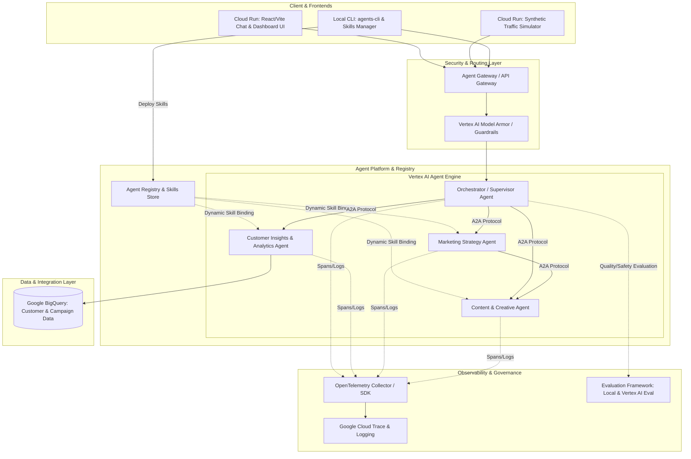

# Google Cloud Agent Platform: Multi-Agent Marketing Demo

An enterprise-grade reference architecture for building, deploying, orchestrating, securing, and evaluating autonomous AI agents on **Google Cloud Platform (GCP)**.

Demonstrated through a **Multi-Agent Marketing Analytics & Creative Content System** powered by **Vertex AI Agent Engine**, **Agent Registry & Skills**, **Agent-to-Agent (A2A) Protocol**, **Agent Gateway & Model Armor**, **Google BigQuery**, **OpenTelemetry Observability**, and **Cloud Run**.

---

## 🏛️ System Architecture



---

## 🚀 Key Platform Features

1. **Vertex AI Agent Engine**: Multi-agent hosting runtime with supervisor delegation.
2. **Agent Registry & Agent Skills**: Dynamic binding of specialized marketing skills:
   - `skills/marketing_analytics/SKILL.md` (RFM Customer Segmentation & SQL query templates)
   - `skills/brand_voice/SKILL.md` (Brand persona, copywriting rules & tone guidelines)
   - `skills/omnichannel_strategy/SKILL.md` (Campaign strategy framework & channel mix)
3. **Agent-to-Agent (A2A) Protocol**: Standardized message passing envelope with inter-agent routing, message history context, and span correlation.
4. **Agent Gateway & Model Armor**: Security enforcement filtering prompt injections, blocking toxic inputs, and masking sensitive PII.
5. **Google BigQuery Integration**: Native integration for cohort extraction, RFM analysis, and customer segment metrics (with local mock fallback).
6. **OpenTelemetry Observability**: Open standards distributed tracing exported to Cloud Trace, Cloud Logging, and Cloud Monitoring.
7. **Dual Evaluation Engine**:
   - **Local Evaluation**: `eval/local_eval.py` testing grounding, safety accuracy, and A2A routing completeness.
   - **Cloud Evaluation**: `eval/vertex_eval.py` integrating with Vertex AI Rapid Evaluation API.
8. **Synthetic Traffic Simulator**: Continuous load generator (`simulator/traffic_generator.py`) simulating active user traffic for demo and evaluation monitoring.
9. **`agents-cli` Local Tooling**: CLI for inspecting, testing, evaluating, and registering skills locally.

---

## 📁 Repository Structure

```
agent_platform_demo/
├── agents/
│   ├── base_agent.py             # Agent interface, OTel tracing, Model Armor & Skill loader
│   ├── orchestrator_agent.py     # Supervisor agent coordinating multi-agent pipeline
│   ├── analytics_agent.py        # BigQuery customer insights agent (RFM skill)
│   ├── strategy_agent.py         # Marketing strategy generation agent (Campaign skill)
│   ├── content_agent.py          # Creative copywriting agent (Brand Voice skill)
│   └── a2a_protocol.py           # A2A envelope protocol definition & message router
├── skills/                       # Agent Registry Skills
│   ├── marketing_analytics/      # RFM segmentation & BigQuery query templates skill
│   ├── brand_voice/              # Brand tone & creative copy guidelines skill
│   └── omnichannel_strategy/     # Campaign framework & channel mix skill
├── backend/
│   ├── app.py                    # FastAPI server exposing Agent Gateway & Registry endpoints
│   ├── config.py                 # GCP Project & service settings
│   ├── gateway.py                # Agent Gateway client & Model Armor inspector
│   ├── bq_client.py              # BigQuery helper and synthetic data fallback
│   └── skill_registry.py        # Agent Registry Skills manager & dynamic binder
├── frontend/                     # React / Vite Dark Mode Web Application
│   ├── src/components/
│   │   ├── ChatInterface.jsx        # Conversational UI with streaming
│   │   ├── AgentGraphVisualizer.jsx # Live A2A interaction flow graph
│   │   ├── SkillsInspector.jsx      # Agent Registry & active skills panel
│   │   ├── BigQueryDataViewer.jsx   # Interactive customer cohort table
│   │   └── SimulatorControls.jsx    # Traffic generator toggle & metrics
│   └── App.jsx
├── eval/
│   ├── local_eval.py             # Local evaluation runner
│   ├── vertex_eval.py            # Vertex AI Evaluation service integration
│   └── dataset/golden_marketing_prompts.json
├── simulator/
│   └── traffic_generator.py      # Background load generator
├── cli/
│   └── agents_cli.py             # Local CLI tool (agents-cli)
└── deploy/
    ├── setup_gcp_resources.sh    # GCP API enablement, BigQuery setup & IAM permissions
    ├── deploy_cloud_run.sh       # Cloud Run deployment script
    └── Dockerfile.backend
```

---

## 💻 Local Quickstart

### 1. Configure Environment Variables (`.env`)
The platform automatically loads environment variables from `.env`. You can edit `.env` directly:

```ini
GCP_PROJECT_ID=your-gcp-project-id
GCP_REGION=us-central1
BIGQUERY_DATASET=marketing_analytics
GEMINI_API_KEY=your_api_key_here
USE_GCP_CLOUD=false  # Set to true to connect to GCP, or false for offline mock testing
```

### 2. Launch Application Locally
Run the all-in-one start script:
```bash
./start_local.sh
```
This script automatically sets up the Python virtual environment, installs dependencies, and launches both the **FastAPI Backend (`http://localhost:8080`)** and **React Dark-Mode Frontend (`http://localhost:3000`)**.

---

### 3. CLI & Evaluation Commands
```bash
# List agents and bound skills
python3 cli/agents_cli.py list

# List Agent Registry Skills
python3 cli/agents_cli.py skills list

# Run Local Evaluation Benchmark
python3 cli/agents_cli.py eval

# Run Traffic Simulator
python3 simulator/traffic_generator.py
```

---

## ☁️ Google Cloud Platform (GCP) Deployment (`agent-demo-09`)

### Option A: Provision Infrastructure via Terraform (Recommended)

1. Authenticate with Google Cloud:
```bash
gcloud auth login
gcloud auth application-default login
gcloud config set project agent-demo-09
```

2. Initialize and Apply Terraform:
```bash
cd terraform
terraform init
terraform plan
terraform apply
```

This automatically provisions:
- GCP API Enablement (`aiplatform`, `bigquery`, `run`, `apigateway`, `cloudtrace`, `apikeys`)
- Artifact Registry Repository (`agent-platform`)
- BigQuery Dataset (`marketing_analytics`) & Tables (`customer_transactions`, `customer_rfm_summary`)
- Service Account (`agent-platform-sa@agent-demo-09.iam.gserviceaccount.com`) & IAM Role Bindings
- Gemini API Key (`gemini-agent-api-key`)
- Cloud Run Service (`agent-platform-backend`)

---

### Option B: Deploy via Shell Scripts

```bash
export GCP_PROJECT_ID="agent-demo-09"
export GCP_REGION="us-central1"

./deploy/setup_gcp_resources.sh
./deploy/deploy_cloud_run.sh
```

---

## 🛡️ Security & Safety (Model Armor)

Model Armor is enabled at the Agent Gateway floor level (`Config.MODEL_ARMOR_FLOOR_ID`):
- **Prompt Injection Defense**: Blocks attempts to override system prompts or execute SQL drops.
- **PII Masking**: Redacts raw email addresses or sensitive customer identifiers before sending prompts to downstream agents.
- **Unsafe Content Filtering**: Filters toxic or non-compliant text generation.
