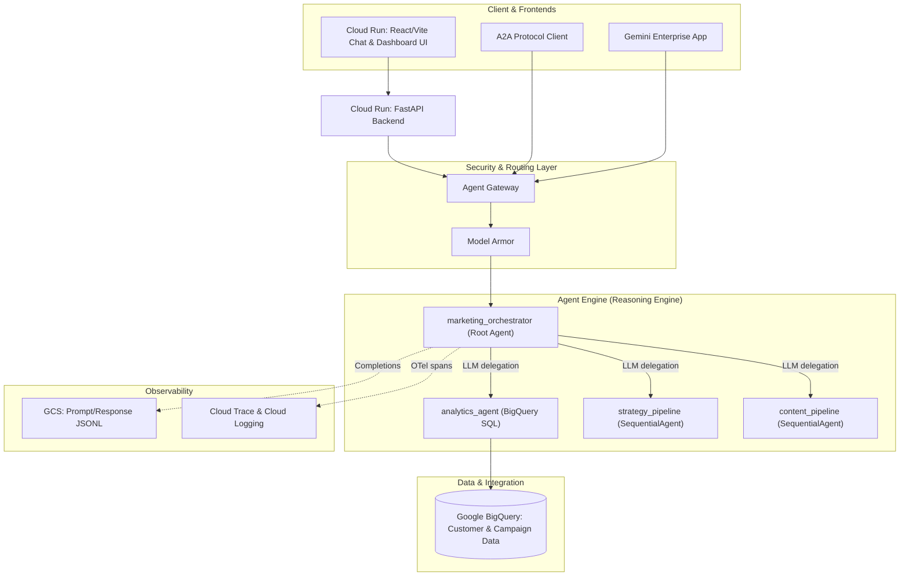

# Google Cloud Agent Platform: Multi-Agent Marketing Demo

An enterprise-grade reference architecture for building, deploying, orchestrating, securing, and evaluating autonomous AI agents on **Google Cloud Platform (GCP)**.

Demonstrated through a **Multi-Agent Marketing Analytics & Creative Content System** powered by **Agent Engine**, **Agent Registry & Skills**, **Agent-to-Agent (A2A) Protocol**, **Agent Gateway & Model Armor**, **Google BigQuery**, **OpenTelemetry Observability**, and **Cloud Run**.

---

## 🏛️ System Architecture



---

## 🚀 Key Platform Features

1. **Agent Engine**: Multi-agent hosting runtime with LLM-driven supervisor delegation via Google ADK.
2. **Agent Registry & Skills**: Dynamic binding of marketing skills from local `skills/` directories:
   - `skills/bigquery-customer-analytics/SKILL.md` — RFM segmentation & BigQuery SQL templates
   - `skills/brand-voice-craft/SKILL.md` — Brand persona, copywriting rules & tone guidelines
   - `skills/campaign-framework/SKILL.md` — Campaign strategy framework & channel mix
3. **Agent-to-Agent (A2A) Protocol**: Agent serves `/.well-known/agent-card.json` and `/a2a/app` JSON-RPC endpoint for standardized inter-agent communication.
4. **Agent Gateway & Model Armor**: Infrastructure-level security enforcement — prompt injection detection, PII masking, and Responsible AI filtering via `:streamQuery` governed endpoint.
5. **Google BigQuery Integration**: Native BigQuery SQL execution for cohort extraction, RFM analysis, and customer segment metrics.
6. **Prompt-Response Logging**: Full content capture to GCS (JSONL), Cloud Trace spans, and Cloud Logging events.
7. **Synthetic Traffic Simulator**: Real traffic generator hitting live Agent Runtime with per-agent KPI breakdown (analytics/strategy/content).
8. **A2A Protocol Explorer**: Frontend tab for fetching agent cards and sending test A2A messages.

---

## 📁 Repository Structure

```
agent_platform_demo/
├── app/                              # ADK Agent Definitions (deployed to Agent Runtime)
│   ├── agent.py                      # Root orchestrator + sub-agents + SequentialAgent pipelines
│   ├── tools.py                      # BigQuery SQL tool, strategy/content generation tools
│   ├── schemas.py                    # Pydantic models for structured output (Strategy, Content)
│   ├── fast_api_app.py               # ADK FastAPI app with A2A routes & OTel Cloud Trace
│   ├── agent_runtime_app.py          # Reasoning Engine adapter for agents-cli deploy
│   └── app_utils/                    # A2A helpers, services, Reasoning Engine adapter
├── skills/                           # Agent Skills (loaded via SkillToolset)
│   ├── bigquery-customer-analytics/  # RFM segmentation & BigQuery query skill
│   ├── brand-voice-craft/            # Brand tone & creative copy guidelines skill
│   └── campaign-framework/           # Campaign framework & channel mix skill
├── backend/                          # Cloud Run FastAPI Backend (thin API proxy)
│   ├── app.py                        # REST endpoints, traffic simulator, A2A proxy, eval runner
│   ├── config.py                     # GCP project & service settings
│   ├── agent_runtime_client.py       # Proxies to Agent Runtime via :streamQuery
│   └── bq_client.py                  # BigQuery data browsing helper
├── frontend/                         # React / Vite Web Application (Cloud Run)
│   ├── src/App.jsx                   # Main app with tab navigation & theme toggle
│   └── src/components/
│       ├── ChatInterface.jsx         # Conversational UI with streaming
│       ├── A2AExplorer.jsx           # A2A protocol explorer with agent card modal
│       ├── AgentGraphVisualizer.jsx  # Live agent interaction flow graph
│       ├── SimulatorControls.jsx     # Traffic simulator with per-agent KPI dashboard
│       ├── SkillsInspector.jsx       # Agent Registry & active skills panel
│       └── BigQueryDataViewer.jsx    # Interactive customer cohort table
├── eval/                             # Evaluation framework
│   ├── run_eval.py                   # Evaluation runner against live Agent Runtime
│   └── dataset/                      # Golden marketing prompts
├── examples/
│   └── a2a_client.py                 # Standalone A2A protocol client example
├── deploy/                           # Deployment scripts & infrastructure
│   ├── agent_gateway.yaml            # Agent Gateway resource spec
│   ├── bind_agent_gateway.py         # Bind Agent Gateway to Reasoning Engine
│   ├── register_skills.py            # Register skills in Agent Registry
│   ├── deploy_backend.sh             # Cloud Run backend deployment
│   ├── deploy_frontend.sh            # Cloud Run frontend deployment
│   ├── enable_observability_permissions.sh  # OTel, Cloud Trace, Log Analytics setup
│   ├── seed_bigquery_data.py         # BigQuery data seeder (200 aligned rows)
│   └── Dockerfile.backend            # Backend container image
├── specs/                            # Architecture documentation
│   ├── APPLICATION_WALKTHROUGH.md    # Comprehensive implementation walkthrough
│   ├── ARCHITECTURE_BLUEPRINT.md     # Architecture blueprint
│   ├── GCP_AGENT_PLATFORM_SERVICES.md # GCP service deep-dive
│   └── architecture/                 # Architecture diagrams
└── .github/workflows/
    └── deploy-gcp.yml                # CI/CD: selective deploy to Cloud Run & Agent Runtime
```

---

## 💻 Local Quickstart

### 1. Configure Environment Variables (`.env`)
```ini
GCP_PROJECT_ID=agent-demo-09
GCP_REGION=us-central1
BIGQUERY_DATASET=marketing_analytics
USE_GCP_CLOUD=true
GEMINI_MODEL=gemini-3.6-flash
GEMINI_LOCATION=global
MODEL_ARMOR_FLOOR_ID=projects/agent-demo-09/locations/us-central1/floors/marketing-floor
```

> **Note**: Do NOT set `GEMINI_API_KEY` when deploying to Agent Runtime — the agent authenticates via SA credentials (ADC). An API key conflicts with Vertex AI auth and causes 401 errors.

### 2. Launch Application Locally
```bash
./start_local.sh
```
This launches both the **FastAPI Backend** (`http://localhost:8080`) and **React Frontend** (`http://localhost:3000`).

### 3. Deploy Agent to Agent Runtime
```bash
agents-cli deploy --project agent-demo-09 --region us-central1 --no-confirm-project
```

### 4. Publish to Gemini Enterprise
```bash
agents-cli publish gemini-enterprise --project agent-demo-09 --region us-central1
```

---

## ☁️ Deployed Infrastructure (GCP Project: `agent-demo-09`)

| Component | Resource |
|-----------|----------|
| **Cloud Run Backend** | `https://agent-platform-backend-q5c3bhebga-uc.a.run.app` |
| **Cloud Run Frontend** | `https://agent-platform-frontend-1047232371360.us-central1.run.app` |
| **Agent Runtime** | `projects/1047232371360/locations/us-central1/reasoningEngines/3829020106671783936` |
| **Agent Gateway** | `projects/agent-demo-09/locations/us-central1/agentGateways/marketing-agent-gateway` |
| **Model Armor Floor** | `projects/agent-demo-09/locations/us-central1/floors/marketing-floor` |
| **GCS Logs Bucket** | `gs://agent-demo-09-agent-platform-logs` |
| **BigQuery Dataset** | `agent-demo-09.marketing_analytics` |
| **CI/CD Pipeline** | `.github/workflows/deploy-gcp.yml` |

---

## 🛡️ Security & Safety (Agent Gateway + Model Armor)

Model Armor is enforced at the **Agent Gateway infrastructure level** — no application-level pre-flight checks. All prompt traffic passes through the governed `:streamQuery` endpoint:

- **Prompt Injection Defense**: Blocks attempts to override system prompts.
- **PII Masking**: Redacts email addresses and sensitive customer identifiers.
- **Unsafe Content Filtering**: Filters toxic or non-compliant text generation.

Gateway spec: [`deploy/agent_gateway.yaml`](deploy/agent_gateway.yaml)

---

## 📊 Observability & Logging

Prompt-response content is captured in **three destinations**:

| Destination | Content | Access |
|------------|---------|--------|
| **GCS** | Full prompt/response JSONL | `gsutil ls gs://agent-demo-09-agent-platform-logs/completions/` |
| **Cloud Trace** | Content in OTel spans | Cloud Console → Trace Explorer |
| **Cloud Logging** | GenAI interaction events | Cloud Console → Logs Explorer |

> **Known Limitation**: Online evaluation monitors do not work with multi-agent systems. The monitor requires uniform `gen_ai.system_instructions` across all spans in a trace, but multi-agent traces contain different instructions per sub-agent. Use per-trace manual evaluation or batch evaluation instead.

---

## 📚 Documentation

| Document | Description |
|----------|-------------|
| [LOCAL_EVALUATION_GUIDE.md](docs/LOCAL_EVALUATION_GUIDE.md) | Local multi-agent evaluation guide, CLI commands, custom metrics, and Quality Flywheel |
| [EVALUATION_BASELINE_AND_PROGRESSION.md](specs/EVALUATION_BASELINE_AND_PROGRESSION.md) | Archived v1.0.0 prompt baseline, agent structure snapshot, and 15-case scorecard |
| [APPLICATION_WALKTHROUGH.md](specs/APPLICATION_WALKTHROUGH.md) | End-to-end implementation walkthrough with code snippets |
| [ARCHITECTURE_BLUEPRINT.md](specs/ARCHITECTURE_BLUEPRINT.md) | Architecture blueprint and design decisions |
| [GCP_AGENT_PLATFORM_SERVICES.md](specs/GCP_AGENT_PLATFORM_SERVICES.md) | Deep-dive into every GCP service used |
| [DEPLOY.md](specs/DEPLOY.md) | Deployment guide |
