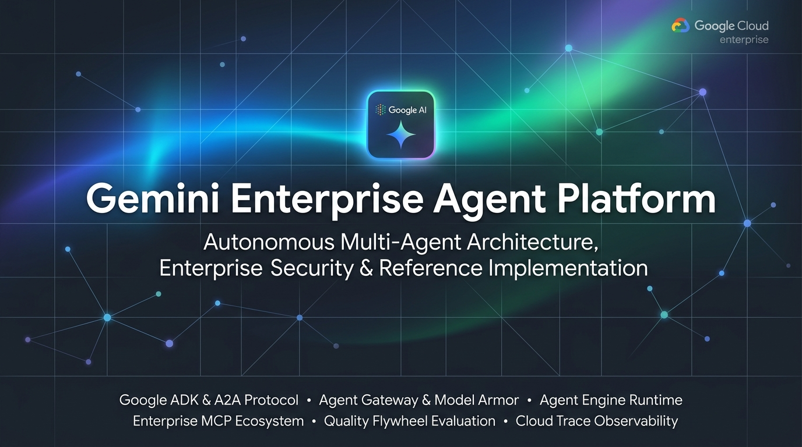
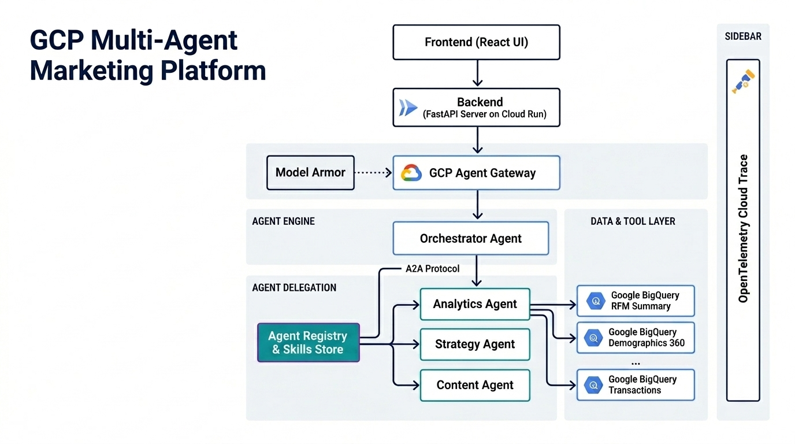
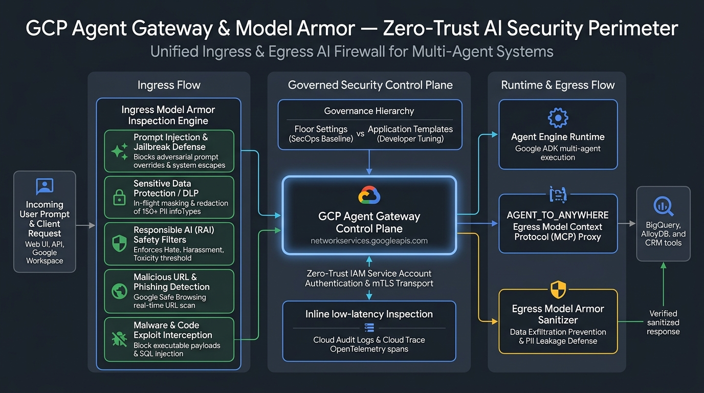
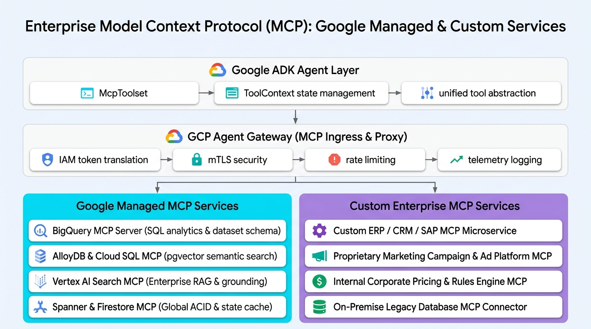
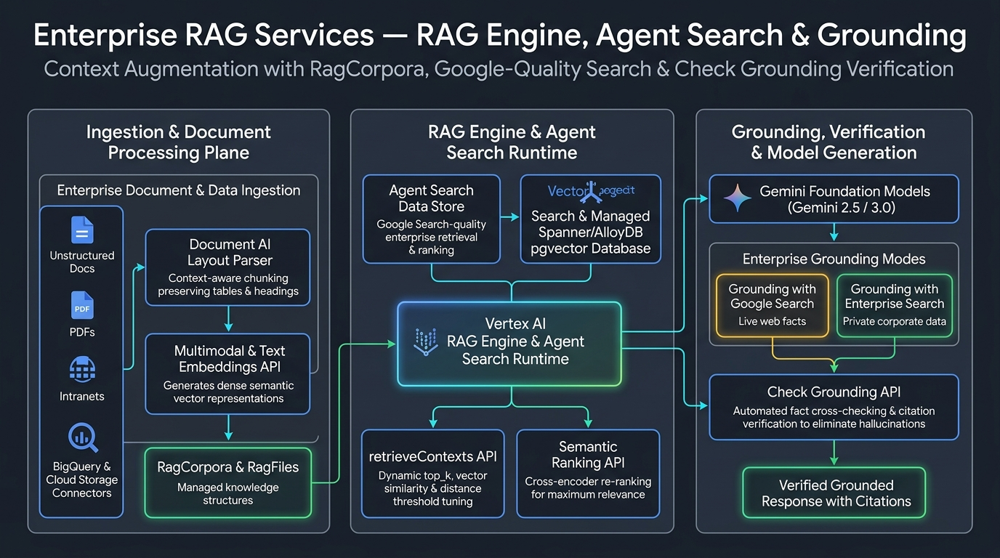
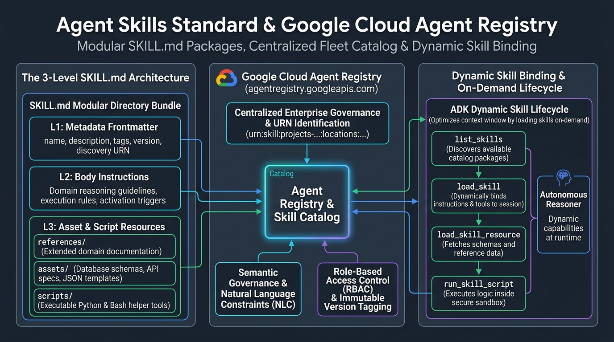
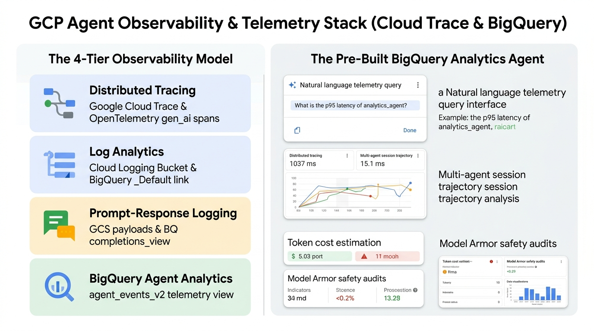
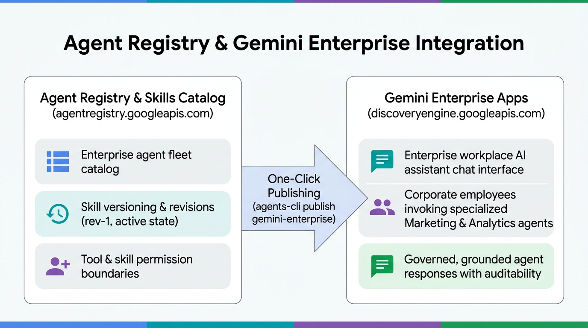

# Gemini Enterprise Agent Platform — Executive & Technical Presentation Deck

This presentation flow translates the end-to-end multi-agent architecture into a structured **slide-by-slide visual presentation deck**. Each slide pairs a high-resolution architecture infographic with executive talking points, technical pillars, and Google Cloud Agent Platform service mappings.

---

## 📑 Slide Deck Table of Contents

1. [Slide 1: Gemini Enterprise Agent Platform (Title Cover)](#slide-1-gemini-enterprise-agent-platform-title-cover)
2. [Slide 2: End-to-End Enterprise Architecture Overview](#slide-2-end-to-end-enterprise-architecture-overview)
3. [Slide 3: Multi-Agent Orchestration with Google ADK & A2A Protocol](#slide-3-multi-agent-orchestration-with-google-adk--a2a-protocol)
4. [Slide 4: Zero-Trust Security Perimeter — Agent Gateway & Model Armor](#slide-4-zero-trust-security-perimeter--agent-gateway--model-armor)
5. [Slide 5: Agent Engine & Managed Runtime Services](#slide-5-agent-engine--managed-runtime-services)
6. [Slide 6: Model Context Protocol (MCP) — Managed & Custom Enterprise Services](#slide-6-model-context-protocol-mcp--managed--custom-enterprise-services)
7. [Slide 7: Enterprise RAG Services — RAG Engine, Agent Search & Grounding](#slide-7-enterprise-rag-services--rag-engine-agent-search--grounding)
8. [Slide 8: Agent Skills Standard & Google Cloud Agent Registry](#slide-8-agent-skills-standard--google-cloud-agent-registry)
9. [Slide 9: Continuous Quality Flywheel, Agent Evaluation & Online Monitors](#slide-9-continuous-quality-flywheel-agent-evaluation--online-monitors)
10. [Slide 10: 4-Tier Observability, Cloud Trace & BigQuery Analytics Agent](#slide-10-4-tier-observability-cloud-trace--bigquery-analytics-agent)
11. [Slide 11: Agent Registry & Gemini Enterprise Workplace Publishing](#slide-11-agent-registry--gemini-enterprise-workplace-publishing)

---

## Slide 1: Gemini Enterprise Agent Platform (Title Cover)

> **Key Takeaway:** A comprehensive reference architecture and enterprise guide for building, governing, evaluating, and operating autonomous multi-agent AI systems on Google Cloud Platform.

### 🎙️ Speaker Notes & Key Points:
* **Enterprise Architecture Deep-Dive**: Navigates the paradigm shift from single-turn chatbots to production-grade autonomous multi-agent systems.
* **The Core Engineering Pillars**:
  1. **Agent Development**: Google ADK (`google-adk`), Sequential pipelines, and A2A Protocol federation.
  2. **AI Firewall**: Agent Gateway and Model Armor zero-trust inspection across prompts, completions, and tools.
  3. **Managed Runtime**: Agent Engine serverless container runtime, Session Service, and Memory Bank.
  4. **Unified Tool Ecosystem**: Google Managed MCPs (BigQuery, AlloyDB) & Custom enterprise microservices.
  5. **Enterprise RAG**: RagCorpora, Google-quality Agent Search & Check Grounding verification.
  6. **Agent Skills & Registry**: Modular 3-level `SKILL.md` packages and dynamic on-demand runtime binding.
  7. **Continuous Quality**: Synthetic golden eval datasets, LLM-as-judge scoring, and 10-min production online monitors.
  8. **Observability**: Cloud Trace distributed span trees and conversational BigQuery Analytics Agent.
  9. **Fleet Distribution**: Centralized Agent Registry and 1-click publishing to corporate Gemini Enterprise chat.

---

## Slide 2: End-to-End Enterprise Architecture Overview

> **Key Takeaway:** A production-grade multi-agent platform on Google Cloud combines agent development frameworks (ADK), edge security (Model Armor), serverless runtime (Agent Engine), enterprise data, continuous evaluation, and workplace distribution (Gemini Enterprise).

### 🎙️ Speaker Notes & Key Points:
* **The Integrated Enterprise Stack**: Unifies developer experience, runtime hosting, ingress security, tool protocols, observability, evaluation, and end-user distribution.
* **Separation of Concerns**: Decouples conversational interaction (React / Cloud Run) from cognitive reasoning (Agent Engine) and external data execution.
* **Enterprise Guardrails**: AI-native safety (Model Armor) sits at the network boundary, ensuring all ingress prompts and egress completions are inspected in real time.

---

## Slide 3: Multi-Agent Orchestration with Google ADK & A2A Protocol

> **Key Takeaway:** Google ADK (`google-adk`) and the open Agent-to-Agent (A2A) protocol provide standard primitives for hierarchical routing, deterministic reasoning pipelines, and cross-boundary agent federation.

### 🎙️ Speaker Notes & Key Points:
* **Orchestration Primitives**:
  * `Agent`: Core persona reasoner with instructions, tools, and Gemini model binding.
  * `SequentialAgent`: Chains reasoning and JSON schema formatting deterministically.
  * `ParallelAgent` & `LoopAgent`: Handles concurrent fan-outs and iterative refinement.
* **A2A Protocol & Agent Cards**: Exposes machine-readable `.well-known/agent-card.json` manifests for peer-to-peer discovery and distributed microservice delegation across GCP projects.
* **The `agents-cli` Lifecycle Flywheel**: Drives the developer loop across **Scaffold → Build → Evaluate → Deploy → Publish → Observe**.

---

## Slide 4: Zero-Trust Security Perimeter — Agent Gateway & Model Armor

> **Key Takeaway:** GCP Agent Gateway and Model Armor deliver a multi-layered AI Firewall inspecting ingress prompts, egress completions, and tool transactions without latency bottlenecks.

### 🎙️ Speaker Notes & Key Points:
* **5 Defensive Security Pillars**:
  1. **Prompt Injection & Jailbreak Defense**: Neutralizes adversarial prompt attacks.
  2. **Sensitive Data Protection (SDP/DLP)**: Real-time PII masking across 150+ infoTypes.
  3. **Responsible AI (RAI) Filters**: Threshold enforcement for hate, harassment, and toxic content.
  4. **Malicious URI & Phishing Detection**: Real-time URL threat intelligence checks.
  5. **Malware & Executable Interception**: Blocks malicious payload delivery in tool args.
* **Floor Settings vs. Application Templates**: Enforces immutable enterprise-wide baseline policies while allowing application-level customization.

---

## Slide 5: Agent Engine & Managed Runtime Services

> **Key Takeaway:** Agent Engine (`reasoningEngines`) provides a fully managed, autoscaling container runtime equipped with turnkey session persistence, semantic memory, and artifact storage.

### 🎙️ Speaker Notes & Key Points:
* **Serverless Agent Containers**: Automatically builds, packages, and scales ADK agent code with zero server management.
* **Session Service**: Manages multi-turn conversation history and state propagation under `/apps/.../sessions`.
* **Memory Bank (`MemoryBankConfig`)**: Provides semantic long-term customer memory and vector search retrieval across sessions.
* **GCS Artifact Service**: Securely stores generated campaign creatives, PDF reports, and export files with KMS encryption.

---

## Slide 6: Model Context Protocol (MCP) — Managed & Custom Enterprise Services

> **Key Takeaway:** Standardized Agent-to-Tool interoperability via the Model Context Protocol (MCP) seamlessly integrates first-party Google-managed data stores and custom self-hosted enterprise microservices under unified Agent Gateway security.

### 🎙️ Speaker Notes & Key Points:
* **Unified ADK Agent Layer**:
  * `McpToolset` & `ToolContext`: Binds multiple MCP servers as native agent tools with full state access.
  * Declarative tool abstraction insulating agents from backend communication protocols.
* **GCP Agent Gateway MCP Ingress & Proxy**:
  * Enforces IAM token translation, project headers, mTLS encryption, rate limiting, and audit logging across all tool calls.
* **Google Managed MCP Services**:
  * **BigQuery MCP Server**: Dataset schema introspection and BigQuery SQL execution.
  * **AlloyDB & Cloud SQL MCP**: `pgvector` semantic similarity search and transactional SQL.
  * **Enterprise Search MCP**: Unstructured document RAG and enterprise grounding.
  * **Spanner & Firestore MCP**: Global ACID transactions and real-time state caching.
* **Custom Enterprise MCP Services**:
  * **ERP / CRM / SAP Microservices**: Bridges core corporate data (SAP, Salesforce) into agent workflows.
  * **Proprietary Marketing & Ad Platform MCP**: Custom ad-tech bidding, audience syndication, and channel execution.
  * **Internal Rules & Pricing Engine MCP**: Proprietary discount calculations and margin validation.
  * **Legacy Database MCP Connectors**: On-premise mainframe and database integration.

---

## Slide 7: Enterprise RAG Services — RAG Engine, Agent Search & Grounding

> **Key Takeaway:** Vertex AI RAG Engine and Agent Search provide managed enterprise RAG orchestration, document ingestion, vector retrieval, and automated Check Grounding API citation verification.

### 🎙️ Speaker Notes & Key Points:
* **Managed RAG Engine Architecture**:
  * Operates on `RagCorpora` and `RagFiles` data structures.
  * `retrieveContexts` API supports dynamic `top_k`, `vector_distance_threshold`, and `vector_similarity_threshold` tuning.
  * Backed by managed Google Cloud Spanner vector instances and AlloyDB pgvector.
* **Agent Search & Enterprise Data Stores**:
  * Google Search-quality semantic and keyword search engine indexing unstructured enterprise repositories (PDFs, Docs, intranet).
  * Built-in connectors for BigQuery, Cloud Storage, and third-party SaaS repositories.
* **Document AI Layout Parser & Embeddings API**:
  * Parses complex PDFs into structured, context-aware chunks preserving tables and headings before generating high-dimensional dense embeddings.
* **Check Grounding API & Anti-Hallucination**:
  * Deterministically cross-references model responses against retrieved fact citations to verify factual accuracy and eliminate hallucinations before returning answers to users.

---

## Slide 8: Agent Skills Standard & Google Cloud Agent Registry

> **Key Takeaway:** Agent Skills package domain expertise into modular 3-level bundles (`SKILL.md`) managed in the Google Cloud Agent Registry and dynamically bound on-demand to optimize context windows.

### 🎙️ Speaker Notes & Key Points:
* **The 3-Level `SKILL.md` Architecture**:
  * **L1 (Metadata Frontmatter)**: YAML frontmatter with `name`, `description`, discovery tags, and `URN`.
  * **L2 (Body Instructions)**: In-depth domain reasoning guidelines and execution rules.
  * **L3 (Resource Bundles)**: `references/` (documentation), `assets/` (database schemas & API templates), and `scripts/` (executable Python/Bash helpers).
* **Google Cloud Agent Registry (`agentregistry.googleapis.com`)**:
  * Centralized enterprise catalog governing skill packages via URNs (`urn:skill:projects-...:locations:...`), versioning, and Role-Based Access Control (RBAC).
* **Dynamic Skill Binding & On-Demand Retrieval**:
  * ADK agents discover and bind skills at runtime using `list_skills`, `load_skill`, `load_skill_resource`, and `run_skill_script` inside isolated sandboxes.
* **Semantic Governance**: Applies Natural Language Constraints (NLC) to intercept skill loading and enforce strict enterprise compliance policies.

---

## Slide 9: Continuous Quality Flywheel, Agent Evaluation & Online Monitors

> **Key Takeaway:** The Agent Platform Evaluation Service closes the quality gap through a continuous 5-step Quality Flywheel spanning local rapid grading, CI/CD batch evals, and 10-minute production online monitors.

### 🎙️ Speaker Notes & Key Points:
* **The 5-Step Continuous Quality Flywheel**:
  1. **Dataset Synthesis**: User simulation generating multi-turn golden prompt test cases.
  2. **Trace Capture**: Runtime execution capturing OpenTelemetry `gen_ai` semantic spans.
  3. **Multi-Metric Scoring**: Managed LLM judges (Faithfulness, Grounding, Safety) + custom rubrics (`LLMMetric`, `CodeExecutionMetric`).
  4. **Loss Analysis**: Automated failure clustering and error diagnostics.
  5. **Optimization**: Prompt tuning and tool adjustments benchmarked in Agent Engine Experiments.
* **Production Online Monitors**: Automated 10-minute scheduled sampling jobs evaluating live production traces in-situ.

---

## Slide 10: 4-Tier Observability, Cloud Trace & BigQuery Analytics Agent

> **Key Takeaway:** End-to-end distributed observability unites OpenTelemetry span tracing with a pre-built BigQuery Analytics Agent for natural-language telemetry inspection.

### 🎙️ Speaker Notes & Key Points:
* **4-Tier Observability Model**:
  * **Tier 1 (Cloud Trace)**: Distributed span trees and turn-by-turn latency profiling.
  * **Tier 2 (Cloud Logging)**: Real-time stdout stream linked to BigQuery via Log Analytics.
  * **Tier 3 (Prompt-Response Logging)**: GCS completions payload sync for compliance & audits.
  * **Tier 4 (BigQuery Agent Analytics)**: Turn-level metadata view (`agent_events_v2`).
* **Pre-Built BigQuery Analytics Agent**: Interactive natural-language assistant answering queries about p95 latencies, error clusters, token costs, and safety violations.

---

## Slide 11: Agent Registry & Gemini Enterprise Workplace Publishing

> **Key Takeaway:** Deployed agents are governed in the Agent Registry catalog and published directly into Gemini Enterprise Apps for friction-free corporate workplace adoption.

### 🎙️ Speaker Notes & Key Points:
* **Agent Registry & Skills Catalog (`agentregistry.googleapis.com`)**:
  * Centralized catalog of enterprise agents, skills, and revisions.
  * Role-based access control and skill lifecycle management.
* **One-Click Publishing (`agents-cli publish gemini-enterprise`)**:
  * Instant deployment to corporate Gemini Enterprise chat interfaces.
  * Empowers business users to run data-backed campaigns directly from Google Workspace.
