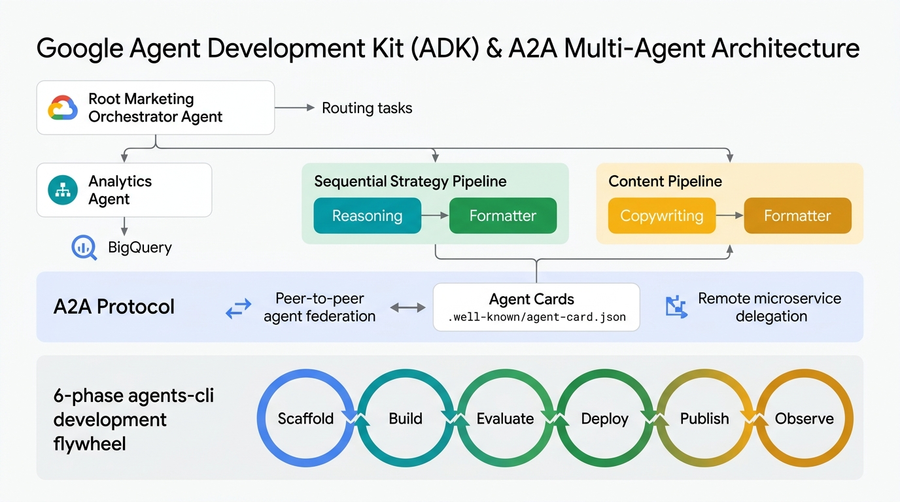
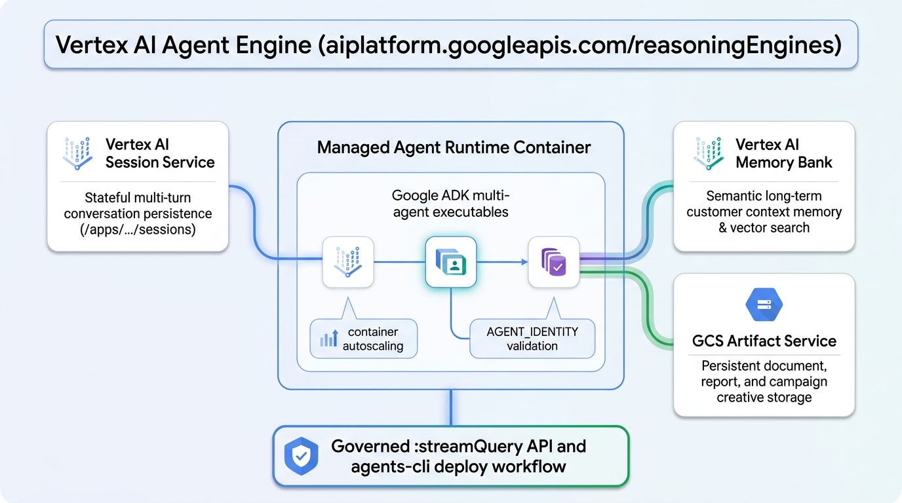
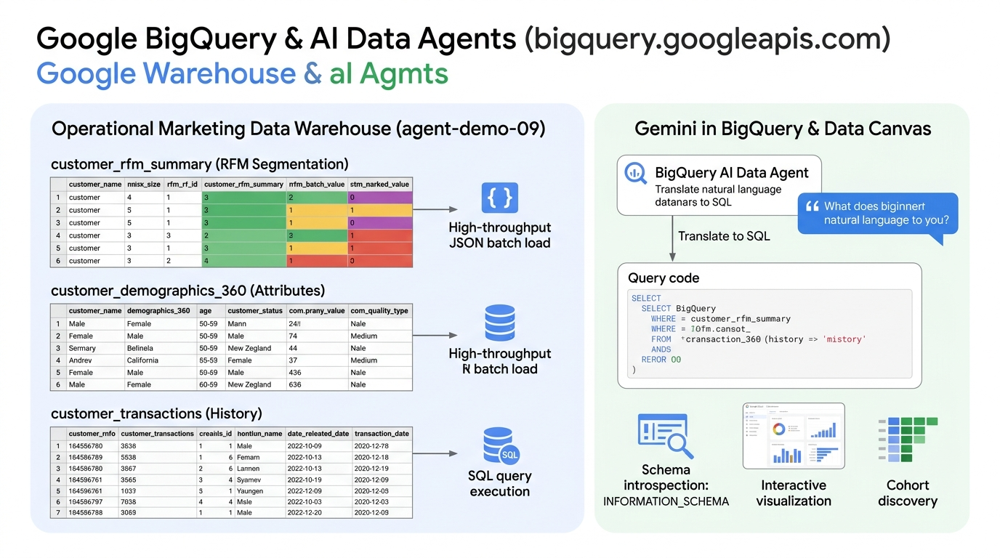
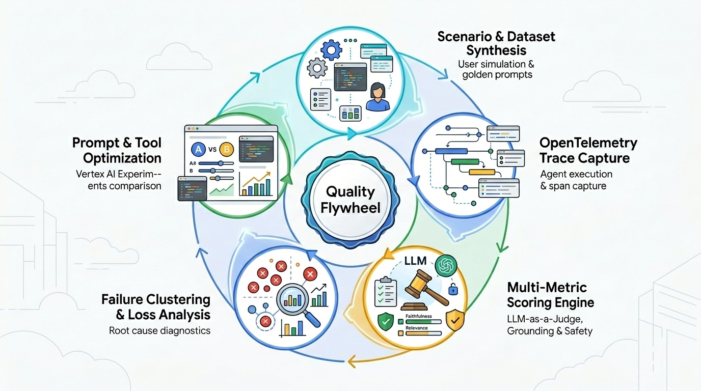

# GCP Agent Platform Architecture & Services Technical Deep-Dive

This document provides a comprehensive, service-by-service architectural guide for building, securing, executing, evaluating, and monitoring multi-agent AI applications on **Google Cloud Platform (GCP)**.

It details the core **GCP Services** and **Agent Platform Infrastructure Components** used in this application, explaining their features, operational roles, configuration parameters, and implementation code.

---

## 🏛️ GCP & Agent Platform Service Stack Overview

```
┌────────────────────────────────────────────────────────────────────────────────────────┐
│ 1. AGENT DEVELOPMENT & ORCHESTRATION LAYER                                             │
│    • Google ADK (google.adk) ──> Hierarchical Multi-Agent Executable (App)             │
│    • Agent-to-Agent Protocol (A2A) ──> Cross-Agent Discovery & Distributed Delegation   │
│    • Skills Standard (SKILL.md) & MCP Toolsets ──> Modular Agent Capabilities          │
└───────────────────────────────────────────┬────────────────────────────────────────────┘
                                            │
                                            v
┌────────────────────────────────────────────────────────────────────────────────────────┐
│ 2. SERVERLESS HOSTING & API LAYER                                                      │
│    • Google Cloud Run (run.googleapis.com) ──> FastAPI Backend & React Frontend        │
└───────────────────────────────────────────┬────────────────────────────────────────────┘
                                            │
                                            v (REST HTTP/JSON)
┌────────────────────────────────────────────────────────────────────────────────────────┐
│ 3. SECURITY & GOVERNANCE LAYER                                                         │
│    • GCP Agent Gateway (networkservices.googleapis.com) ──> Ingress Access Policies     │
│    • Vertex AI Model Armor (modelarmor.googleapis.com) ──> PII Masking & Jailbreak Defense │
└───────────────────────────────────────────┬────────────────────────────────────────────┘
                                            │
                                            v (Governed :streamQuery API)
┌────────────────────────────────────────────────────────────────────────────────────────┐
│ 4. AGENT ENGINE RUNTIME & MANAGED PLATFORM SERVICES                                    │
│    • Vertex AI Agent Engine (aiplatform.googleapis.com/reasoningEngines)               │
│      ├── Agent Runtime Container ──> Hosts Google ADK Multi-Agent Executable             │
│      ├── Vertex AI Session Service ──> Stateful Session Persistence                      │
│      ├── Vertex AI Memory Service (MemoryBankConfig) ──> Semantic Memory Bank           │
│      └── GCS Artifact Service ──> Campaign Asset & Document Storage                      │
│    • Agent Registry & Skills (agentregistry.googleapis.com) ──> Dynamic Skill Binding   │
└───────────────────────────────────────────┬────────────────────────────────────────────┘
                                            │
                      ┌─────────────────────┼─────────────────────┐
                      │                     │                     │
                      v                     v                     v
┌──────────────────────────┐  ┌──────────────────────────┐  ┌──────────────────────────┐
│ 5. TOOLS & DATA LAYER    │  │ 6. EVALUATION & FLYWHEEL │  │ 7. OBSERVABILITY & FLEET │
│  • Tools & Managed MCP   │  │  • Vertex AI GenAI Eval  │  │  • OpenTelemetry Traces  │
│  • Google BigQuery       │  │  • Experiments Tracking  │  │  • Cloud Logging & Sinks │
│    (marketing_analytics) │  │  • agents-cli eval Suite │  │  • BigQuery Agent Events │
│  • Agent Registry Skills │  │  • 10-min Online Monitor │  │  • Gemini Enterprise Pub │
└──────────────────────────┘  └──────────────────────────┘  └──────────────────────────┘
```

---

## 1. Building Multi-Agent Systems with Google ADK (`google-adk` Python SDK)

### 1.1 What is Google ADK & Why Build Agents With It?

The **Google Agent Development Kit (ADK)** (`google-adk`) is Google's official, open-source framework designed specifically for developing, composing, testing, evaluating, and deploying autonomous AI agents and multi-agent hierarchies.

ADK provides enterprise-grade abstractions that eliminate boilerplate and enforce software engineering discipline across agent development:

* **Native Vertex AI & Gemini Integration**: Optimized for Gemini models (`gemini-3.6-flash`, `gemini-3.7-flash`), taking full advantage of native function calling, thinking budgets, and multimodality.
* **First-Class Multi-Agent Patterns**: Built-in orchestration primitives including hierarchical supervisor routing (`sub_agents`), sequential pipelines (`SequentialAgent`), parallel fan-outs (`ParallelAgent`), and iterative evaluation loops (`LoopAgent`).
* **Open Skills Standard (`SKILL.md`)**: Encapsulates domain expertise, execution instructions, and reference schemas into modular directory bundles loaded via `SkillToolset`.
* **Stateful Sessions & Memory**: Standardized session state access via `ToolContext.state`, supporting state propagation across pipeline stages and long-term memory via Vertex AI Memory Service.
* **Standardized Protocol Interoperability**: Direct integration with the **Model Context Protocol (MCP)** via `McpToolset` and **Agent-to-Agent (A2A)** discovery protocols.
* **Schema-Enforced Outputs**: Enforces strict Pydantic JSON validation (`output_schema`, `output_key`), guaranteeing deterministic contracts for downstream consumers and frontends.
* **Turnkey Packaging (`App`)**: Wraps the multi-agent hierarchy into an `App` executable that runs identically in local CLI tests, FastAPI web servers, and Vertex AI Agent Engine.

---

### 1.2 Multi-Agent Orchestration Architecture & Primitives



```
                             ┌──────────────────────────────────┐
                             │       Marketing Orchestrator     │
                             │        (Root Agent / Router)     │
                             └─────────────────┬────────────────┘
                                               │
               ┌───────────────────────────────┼───────────────────────────────┐
               │ (Direct Delegate)             │ (Stateful Pipeline)           │ (Stateful Pipeline)
               v                               v                               v
┌──────────────────────────────┐ ┌──────────────────────────────┐ ┌──────────────────────────────┐
│       Analytics Agent        │ │      Strategy Pipeline       │ │       Content Pipeline       │
│  • Tools: query_customer_data│ │  (SequentialAgent)           │ │  (SequentialAgent)           │
│  • Skills: bigquery_analytics│ │  1. strategy_reasoner (LLM)  │ │  1. content_reasoner (LLM)   │
│  • MCP: mcp_data_toolset     │ │  2. strategy_formatter (JSON)│ │  2. content_formatter (JSON) │
└──────────────────────────────┘ └──────────────────────────────┘ └──────────────────────────────┘
```

1. **The Core Agent (`Agent`)**:
   The fundamental unit representing an LLM reasoner with a defined persona, instructions, and tools:
   ```python
   from google.adk.agents import Agent

   analytics_agent = Agent(
       name="analytics_agent",
       model="gemini-3.6-flash",
       instruction="You are the Customer Analytics Specialist. Query BigQuery data using SQL tools.",
       tools=[tools.query_customer_data, analytics_skillset],
   )
   ```

2. **Sequential Pipelines (`SequentialAgent`)**:
   Chains multiple sub-agents in a deterministic sequence. A key best-practice pattern is separating free-form **Reasoning** from strict **JSON Schema Formatting**:
   ```python
   from google.adk.agents import SequentialAgent

   strategy_pipeline = SequentialAgent(
       name="strategy_pipeline",
       description="Generates strategic frameworks and formats into validated JSON.",
       sub_agents=[strategy_reasoner, strategy_formatter],
   )
   ```

3. **ToolContext & Shared State Mutation**:
   ADK tools receive a `ToolContext` parameter providing read/write access to session state:
   ```python
   from google.adk.tools import ToolContext

   def query_customer_data(sql_query: str, tool_context: ToolContext) -> dict:
       # Write query results to session state for downstream agents
       tool_context.state["analytics_result"] = {
           "summary": f"Query returned {len(results)} rows.",
           "sql_executed": clean_sql
       }
       return {"status": "SUCCESS", "row_count": len(results)}
   ```

4. **Dynamic Skills (`SkillToolset`)**:
   Loads standardized `SKILL.md` bundles containing domain prompt rules and guidelines:
   ```python
   from google.adk.skills import load_skill_from_dir
   from google.adk.tools.skill_toolset import SkillToolset

   analytics_skill = load_skill_from_dir(skills_dir / "bigquery-customer-analytics")
   analytics_skillset = SkillToolset(skills=[analytics_skill])
   ```

5. **Application Packaging (`App`)**:
   Wraps the root supervisor agent into a standard ADK application:
   ```python
   from google.adk.apps import App

   app = App(
       root_agent=root_agent,
       name="app",  # App name must match directory name for Agent Engine compatibility
   )
   ```

---

### 1.3 Complete ADK Multi-Agent Code Blueprint ([`app/agent.py`](file:///Users/henrikw/Projects/agent_platform_demo/app/agent.py))

Below is the complete multi-agent system implementation from `app/agent.py`:

```python
import os
import pathlib
import google.auth
from google.adk.agents import Agent, SequentialAgent
from google.adk.apps import App
from google.adk.skills import load_skill_from_dir
from google.adk.tools.skill_toolset import SkillToolset
from google.adk.tools.mcp_tool import McpToolset
from google.adk.tools.mcp_tool.mcp_session_manager import SseConnectionParams

from . import tools
from .schemas import StrategySchema, ContentSchema

# Ensure Vertex AI configuration
_, project_id = google.auth.default()
os.environ.setdefault("GOOGLE_CLOUD_PROJECT", project_id or "agent-demo-09")
os.environ.setdefault("GOOGLE_CLOUD_LOCATION", "global")
os.environ.setdefault("GOOGLE_GENAI_USE_VERTEXAI", "True")

# ─── 1. Load Skills from local skills/ directory ──────────────────────────────
skills_dir = pathlib.Path(__file__).parent.parent / "skills"

analytics_skill = load_skill_from_dir(skills_dir / "bigquery-customer-analytics")
strategy_skill = load_skill_from_dir(skills_dir / "campaign-framework")
content_skill = load_skill_from_dir(skills_dir / "brand-voice-craft")

analytics_skillset = SkillToolset(skills=[analytics_skill])
strategy_skillset = SkillToolset(skills=[strategy_skill])
content_skillset = SkillToolset(skills=[content_skill])

# ─── 2. Model Context Protocol (MCP) Toolset Definition ───────────────────────
mcp_data_toolset = McpToolset(
    connection_params=SseConnectionParams(
        url="https://agent-gateway.internal/mcp/v1/data-services",
        headers={"X-GCP-Project-ID": "agent-demo-09"}
    ),
    tool_filter=["query_customer_data"]
)

# ─── 3. Analytics Agent (BigQuery Tool + SkillToolset + MCP) ──────────────────
analytics_agent = Agent(
    name="analytics_agent",
    model="gemini-3.6-flash",
    description="Executes BigQuery customer data analysis, cohort extraction, and RFM segmentation.",
    instruction="""You are the Customer Insights & Analytics Agent.

Your role is to answer data questions by writing BigQuery SQL and executing it with the
query_customer_data tool. Write BigQuery Standard SQL queries targeting table `agent-demo-09.marketing_analytics.customer_rfm_summary`.
""",
    tools=[tools.query_customer_data, analytics_skillset, mcp_data_toolset],
)

# ─── 4. Strategy Pipeline (SequentialAgent: reasoning → formatting) ──────────────
strategy_reasoner = Agent(
    name="strategy_agent",
    model="gemini-3.6-flash",
    description="Reasons about marketing strategy based on analytics data.",
    instruction="""You are the Marketing Strategy Agent.
Create a comprehensive omnichannel marketing strategy based on analytics data available in conversation context.""",
    tools=[strategy_skillset],
    output_key="strategy_reasoning",
)

strategy_formatter = Agent(
    name="strategy_formatter",
    model="gemini-3.6-flash",
    description="Formats strategy reasoning into structured JSON.",
    instruction="Convert the marketing strategy from the conversation into the required JSON structure.",
    output_schema=StrategySchema,
    output_key="strategy_result",
)

strategy_pipeline = SequentialAgent(
    name="strategy_pipeline",
    description="Designs omnichannel marketing strategies, campaign timelines, channel mix, and ROI projections.",
    sub_agents=[strategy_reasoner, strategy_formatter],
)

# ─── 5. Content Pipeline (SequentialAgent: reasoning → formatting) ──────────────
content_reasoner = Agent(
    name="content_agent",
    model="gemini-3.6-flash",
    description="Produces marketing creative assets aligned with brand voice.",
    instruction="""You are the Content & Creative Copywriting Agent.
Generate email templates, social media posts, and SMS copy based on campaign strategy.""",
    tools=[content_skillset],
    output_key="content_reasoning",
)

content_formatter = Agent(
    name="content_formatter",
    model="gemini-3.6-flash",
    description="Formats content reasoning into structured JSON.",
    instruction="Convert the marketing content from the conversation into the required JSON structure.",
    output_schema=ContentSchema,
    output_key="content_result",
)

content_pipeline = SequentialAgent(
    name="content_pipeline",
    description="Produces email templates, social media posts, SMS, and ad copy adhering to brand voice guidelines.",
    sub_agents=[content_reasoner, content_formatter],
)

# ─── 6. Root Orchestrator Agent ────────────────────────────────────────────────
root_agent = Agent(
    name="marketing_orchestrator",
    model="gemini-3.6-flash",
    description="Marketing Campaign Supervisor — routes objectives to Analytics, Strategy, and Content agents.",
    instruction="""You are the Marketing Campaign Orchestrator. Route requests to sub-agents efficiently.
- Data questions -> analytics_agent
- Strategy requests -> analytics_agent -> strategy_pipeline
- Content requests -> content_pipeline
- Full campaign -> analytics_agent -> strategy_pipeline -> content_pipeline
""",
    sub_agents=[analytics_agent, strategy_pipeline, content_pipeline],
)

# ─── ADK App Definition ────────────────────────────────────────────────────────
app = App(
    root_agent=root_agent,
    name="app",
)
```

---

### 1.4 The Agent-to-Agent (A2A) Protocol & Inter-Agent Federation

#### 1. What is the A2A Protocol & Why is it Critical?
While ADK orchestration primitives (`SequentialAgent`, `ParallelAgent`, supervisor hierarchies) coordinate agents within the same process or memory space, enterprise multi-agent architectures often require autonomous agents to collaborate across multiple microservices, different Google Cloud projects, or external partner networks.

The **Agent-to-Agent (A2A) Protocol** is an open, standardized communication and discovery specification (built on JSON-RPC, REST, and Server-Sent Events) designed to enable autonomous agents to discover each other, negotiate capabilities, exchange structured context, and delegate tasks across network boundaries.

```
┌────────────────────────────────────────────────────────────────────────────────────────┐
│                               MCP VS. A2A PROTOCOL SCOPE                               │
├────────────────────────────────────────┬───────────────────────────────────────────────┤
│ MODEL CONTEXT PROTOCOL (MCP)           │ AGENT-TO-AGENT PROTOCOL (A2A)                 │
├────────────────────────────────────────┼───────────────────────────────────────────────┤
│ • Agent-to-Tool / Agent-to-Data        │ • Agent-to-Agent / Peer-to-Peer Federation    │
│ • Database queries, file systems, APIs │ • Autonomous goal delegation & collaboration  │
│ • Stateless tool invocations           │ • Multi-turn conversation & state negotiation │
│ • Primitives: tools, resources, prompts│ • Primitives: Agent Cards, Tasks, DataParts   │
└────────────────────────────────────────┴───────────────────────────────────────────────┘
```

#### 2. Core Primitives of the A2A Protocol

1. **The Standardized Agent Card (`.well-known/agent-card.json`)**:
   - Every A2A-compliant agent publishes a machine-readable JSON manifest at `/a2a/{app_name}/.well-known/agent-card.json`.
   - Declares agent identity, descriptions, capabilities, supported input/output schemas (Pydantic/JSON Schema), and authentication methods.
   - Example Agent Card JSON:
     ```json
     {
       "name": "marketing_orchestrator",
       "description": "Enterprise campaign supervisor delegating analytics, omnichannel strategy, and content generation.",
       "version": "1.0.0",
       "protocolVersion": "0.3.0",
       "capabilities": ["analytics", "strategy", "copywriting"],
       "endpoints": {
         "rpc": "/a2a/app/rpc",
         "events": "/a2a/app/events"
       },
       "skills": ["bigquery-customer-analytics", "campaign-framework", "brand-voice-craft"]
     }
     ```

2. **Exposing an ADK Agent as an A2A Service (`to_a2a` & `attach_a2a_routes`)**:
   - Any ADK `Agent` or `App` natively serves A2A routes out-of-the-box when scaffolded.
   - You can also expose any agent programmatically as an A2A service:
     ```python
     from google.adk.a2a.utils.agent_to_a2a import to_a2a
     from app.agent import root_agent

     # Expose root supervisor agent as an A2A microservice on port 8001
     to_a2a(root_agent, port=8001)
     ```

3. **Consuming Remote Agents as First-Class Sub-Agents (`RemoteA2aAgent`)**:
   - An orchestrator can bind a remote A2A service across the network, treating it identically to a local Python sub-agent:
     ```python
     from google.adk.agents.remote_a2a_agent import RemoteA2aAgent
     from google.adk.agents import Agent

     # 1. Bind remote Pricing & Inventory Agent hosted on Cloud Run in another GCP project
     pricing_agent = RemoteA2aAgent(
         name="remote_pricing_specialist",
         description="Calculates real-time product discounts and checks regional inventory.",
         agent_card_url="https://pricing-service-q5c3bhebga-uc.a.run.app/a2a/pricing/.well-known/agent-card.json"
     )

     # 2. Supervisor delegates to both local sub-agents and remote A2A microservices
     enterprise_orchestrator = Agent(
         name="enterprise_campaign_director",
         model="gemini-3.6-flash",
         instruction="Coordinate marketing campaigns using analytics, strategy, content, and remote pricing agents.",
         sub_agents=[analytics_agent, strategy_pipeline, content_pipeline, pricing_agent]
     )
     ```

4. **Rich Multimodal Payloads & Declarative UI (`A2UI`)**:
   - A2A agents can exchange structured `DataPart` payloads and declarative UI components via the **A2UI** standard (`application/a2ui+json`), allowing downstream web frontends or Gemini Enterprise to render interactive forms, graphs, and approval cards client-side.

#### 3. Multi-Agent Federation Architecture

```
                                    ┌──────────────────────────────────┐
                                    │    Root Marketing Supervisor     │
                                    │      (Agent Engine Runtime)      │
                                    └─────────────────┬────────────────┘
                                                      │ (A2A Protocol / JSON-RPC)
                      ┌───────────────────────────────┼───────────────────────────────┐
                      │ (Local Sub-Agent)             │ (Remote A2A Microservice)     │ (Remote A2A Partner)
                      v                               v                               v
┌──────────────────────────────┐ ┌──────────────────────────────┐ ┌──────────────────────────────┐
│       Analytics Agent        │ │  Remote CRM / Pricing Agent  │ │ External Ad Agency Agent     │
│  (In-Process ADK Sub-Agent)  │ │  (Cloud Run / GKE Microsvc)  │ │ (Partner VPC / A2A Gateway)  │
│  • Local SQL Tools & BigQuery│ │  • Agent Card Discovery      │ │  • Agent Card Discovery      │
│  • Direct Memory Context     │ │  • Remote State Synchronization││  • Delegated Task Execution   │
└──────────────────────────────┘ └──────────────────────────────┘ └──────────────────────────────┘
```

---

### 1.5 The `agents-cli` Lifecycle Toolchain (`google-agents-cli`)

**`agents-cli`** is the official command-line interface accompanying the Google Agent Development Kit (ADK). It orchestrates the end-to-end **Agent Development Lifecycle (ADLC)** across 6 distinct phases:

```
┌────────────────────────────────────────────────────────────────────────────────────────┐
│                          THE AGENTS-CLI DEVELOPMENT FLYWHEEL                           │
├──────────────┬──────────────┬──────────────┬──────────────┬──────────────┬─────────────┤
│ 1. SCAFFOLD  │ 2. BUILD     │ 3. EVALUATE  │ 4. DEPLOY    │ 5. PUBLISH   │ 6. OBSERVE  │
├──────────────┼──────────────┼──────────────┼──────────────┼──────────────┼─────────────┤
│ • create     │ • python ADK │ • synthesize │ • Agent      │ • Gemini     │ • Cloud     │
│ • enhance    │ • skills/    │ • run        │   Engine     │   Enterprise │   Trace     │
│ • upgrade    │ • tools/     │ • grade      │ • Cloud Run  │ • Agent      │ • BigQuery  │
│              │ • schemas/   │ • analyze    │ • GKE        │   Registry   │   Events    │
└──────────────┴──────────────┴──────────────┴──────────────┴──────────────┴─────────────┘
```

#### Core Command Reference:

| Phase | Command | Description |
| :--- | :--- | :--- |
| **Scaffold** | `agents-cli scaffold create <name>` | Bootstraps a production-ready ADK project with recommended folder layout (`app/`, `tests/eval/`, `skills/`). |
| **Enhance** | `agents-cli scaffold enhance .` | Enhances an existing agent with evaluation configurations, deployment scripts, and CI/CD GitHub Actions. |
| **Local Run** | `agents-cli run` or `adk api_server` | Launches a local interactive development web UI and REST API server (`/run`, `/list-apps`) on port 8080. |
| **Synthesize** | `agents-cli eval dataset synthesize` | Automatically generates synthetic multi-turn user simulation test cases and golden datasets. |
| **Run Eval** | `agents-cli eval run --dataset <path>` | Executes test datasets against the agent and captures structured OpenTelemetry execution traces. |
| **Grade Eval**| `agents-cli eval grade --config <yaml>` | Grades execution traces using built-in raters and custom LLM-as-a-judge rubrics. |
| **CI/CD Eval**| `agents-cli eval run-and-grade` | Combines trace execution and grading in a single CI/CD pipeline step with pass/fail exit codes. |
| **Deploy** | `agents-cli deploy` | Packages and deploys the ADK `App` to **Vertex AI Agent Engine** (`reasoningEngines`) or Cloud Run. |
| **Publish** | `agents-cli publish gemini-enterprise` | Registers and exposes the deployed agent inside **Gemini Enterprise Apps** for corporate users. |
| **Registry** | `agents-cli registry list` | Inspects and manages registered skills and agent revisions in the Google Agent Registry. |

#### Example Lifecycle Workflow:

```bash
# 1. Inspect project and environment configuration
agents-cli info

# 2. Run local interactive testing server
agents-cli run --app-dir app

# 3. Execute batch evaluation and rubric grading before deployment
agents-cli eval run-and-grade \
  --dataset tests/eval/datasets/golden_marketing_prompts.json \
  --config tests/eval/eval_config.yaml \
  --project agent-demo-09

# 4. Deploy agent to Vertex AI Agent Engine runtime
agents-cli deploy \
  --project agent-demo-09 \
  --region us-central1 \
  --display-name "marketing-campaign-orchestrator" \
  --app-dir app

# 5. Publish deployed agent to Gemini Enterprise application
agents-cli publish gemini-enterprise \
  --gemini-enterprise-app-id "projects/agent-demo-09/locations/global/collections/default_collection/engines/marketing-app" \
  --display-name "Marketing Campaign Orchestrator" \
  --registration-type adk
```

---

## 2. Google Cloud Run (`run.googleapis.com`) — Ingress & Hosting

### 2.1 GCP Service Features & Capabilities
**Google Cloud Run** is GCP's fully managed serverless container runtime built on Knative:
* **Serverless Container Execution**: Executes stateless HTTP containers automatically scaling from zero to N instances based on request concurrency (`--concurrency`).
* **Built-in Security & Transport**: Automatic HTTPS TLS certificate management, custom domain mapping, and IAM invoker access controls (`--allow-unauthenticated`).
* **Artifact Registry Integration**: Seamlessly pulls and deploys container images stored in GCP Artifact Registry (`{region}-docker.pkg.dev/{project}/{repo}/{image}:{tag}`).

### 2.2 Code & Implementation Details

#### A. Deploying FastAPI Backend Container to Cloud Run ([`deploy/deploy_cloud_run.sh`](file:///Users/henrikw/Projects/agent_platform_demo/deploy/deploy_cloud_run.sh))

```bash
#!/usr/bin/env bash
set -e

PROJECT_ID="agent-demo-09"
REGION="us-central1"
IMAGE_TAG="${REGION}-docker.pkg.dev/${PROJECT_ID}/agent-platform/backend:latest"

# 1. Build Backend Docker Image via Cloud Build
gcloud builds submit --tag "${IMAGE_TAG}" -f deploy/Dockerfile.backend .

# 2. Deploy to Cloud Run with OpenTelemetry environment variables
gcloud run deploy "agent-platform-backend" \
  --image="${IMAGE_TAG}" \
  --region="${REGION}" \
  --platform=managed \
  --port=8080 \
  --allow-unauthenticated \
  --service-account="agent-platform-sa@${PROJECT_ID}.iam.gserviceaccount.com" \
  --set-env-vars="GCP_PROJECT_ID=${PROJECT_ID},GCP_REGION=${REGION},USE_GCP_CLOUD=true,GOOGLE_CLOUD_AGENT_ENGINE_ENABLE_TELEMETRY=true,OTEL_TRACES_EXPORTER=google_cloud_trace"
```

---

## 3. GCP Agent Gateway & Vertex AI Model Armor (`networkservices` & `modelarmor`)

### 3.1 GCP Agent Gateway: Purpose & Enterprise Architecture

**GCP Agent Gateway** (`networkservices.googleapis.com`) is a managed security and networking control plane purpose-built for enterprise AI agent systems. 

As enterprises transition from single-turn conversational chatbots to autonomous multi-agent architectures executing database queries and automated actions, traditional web API gateways fall short. Agent Gateway solves the core governance and operational challenges of enterprise agent systems by establishing a single, governed security perimeter:

```
                  ┌─────────────────────────────────────────────────────────────┐
                  │                 WITHOUT AGENT GATEWAY                       │
                  │  Ungoverned "Spaghetti" Access & Security Blindspots        │
                  │  Client ──> Agent ──> Direct Unrestricted DB/API Access     │
                  └──────────────────────────────┬──────────────────────────────┘
                                                 │
                                                 v
                  ┌─────────────────────────────────────────────────────────────┐
                  │                  WITH GCP AGENT GATEWAY                     │
                  │  Governed Security Perimeter & Zero-Trust Control Plane     │
                  │  Client ──> Agent Gateway (Model Armor & IAM) ──> Agent     │
                  └─────────────────────────────────────────────────────────────┘
```

#### Core Enterprise Ingress & Egress Routing Paths:
* **`CLIENT_TO_AGENT` Ingress**: Governs external and internal client interactions (web applications, IDEs, Workspace) before prompts enter the agent runtime.
* **`AGENT_TO_ANYWHERE` Egress**: Standardizes and secures outbound agent tool calls to internal databases (BigQuery, AlloyDB) and external SaaS services using the Model Context Protocol (MCP).

---

### 3.2 Vertex AI Model Armor (`modelarmor.googleapis.com`): The AI Firewall

**Vertex AI Model Armor** is Google Cloud's managed security service that operates as an intelligent **AI Firewall** across user prompts (ingress) and model responses (egress). It intercepts and neutralizes threats before they can compromise the LLM runtime or exfiltrate sensitive corporate data.

```
                                    ┌───────────────────────────────────┐
                                    │        Incoming User Prompt       │
                                    └─────────────────┬─────────────────┘
                                                      │
                                                      v
┌──────────────────────────────────────────────────────────────────────────────────────────────────────┐
│ GCP AGENT GATEWAY / VERTEX AI MODEL ARMOR (Ingress Interception)                                     │
├──────────────────────────────────────────────────────────────────────────────────────────────────────┤
│ 🛡️ 1. PROMPT INJECTION & JAILBREAK DEFENSE                                                          │
│    • ML-based classifiers detect instruction overrides, roleplay escapes & system manipulation       │
│                                                                                                      │
│ 🔒 2. SENSITIVE DATA PROTECTION (PII / DLP)                                                          │
│    • In-flight masking & redaction of 150+ infoTypes (Emails, SSNs, Credit Cards, API Keys)          │
│                                                                                                      │
│ 🛑 3. RESPONSIBLE AI (RAI) SAFETY FILTERS                                                            │
│    • Hate Speech, Harassment, Sexual Content, and Dangerous Activity thresholds                      │
│                                                                                                      │
│ 🌐 4. MALICIOUS URL & PHISHING DETECTION                                                             │
│    • Google Safe Browsing scans links embedded in prompts and document attachments                  │
│                                                                                                      │
│ 🦠 5. MALWARE & CODE EXPLOIT INTERCEPTION                                                            │
│    • Scans for executable payloads, SQL injection fragments & embedded scripts                       │
└──────────────────────────────────────────────┬───────────────────────────────────────────────────────┘
                                               │
                                               v (Sanitized Prompt / Verified Identity)
┌──────────────────────────────────────────────────────────────────────────────────────────────────────┐
│ VERTEX AI AGENT ENGINE RUNTIME (ADK Multi-Agent Execution)                                           │
│  • marketing_orchestrator ──> analytics_agent (BigQuery) ──> strategy_pipeline ──> content_pipeline   │
└──────────────────────────────────────────────┬───────────────────────────────────────────────────────┘
                                               │
                                               v (Raw Model Generation)
┌──────────────────────────────────────────────────────────────────────────────────────────────────────┐
│ GCP AGENT GATEWAY / VERTEX AI MODEL ARMOR (Egress Interception)                                      │
├──────────────────────────────────────────────────────────────────────────────────────────────────────┤
│ 🛡️ 1. DATA EXFILTRATION & PII LEAKAGE DEFENSE (Redacts unintended sensitive database records)        │
│ 🛡️ 2. OUTPUT SAFETY & BRAND REPUTATION ASSURANCE (Enforces corporate tone & safety boundaries)       │
└──────────────────────────────────────────────┬───────────────────────────────────────────────────────┘
                                               │
                                               v
                                    ┌───────────────────────────────────┐
                                    │    Governed, Sanitized Response   │
                                    └───────────────────────────────────┘
```

#### 1. The 5 Core Defensive Pillars of Model Armor

1. **Prompt Injection & Jailbreak Defense**:
   - Uses specialized Google DeepMind classification models to detect direct and indirect prompt injection attempts, system prompt extraction, jailbreak patterns (`"ignore previous instructions"`, `"DAN mode"`), and multi-turn adversarial evasion.
   - Evaluates risk confidence (`LOW`, `MEDIUM`, `HIGH`) and applies deterministic blocking actions before tokens reach the Gemini model.

2. **Sensitive Data Protection (PII/SDP & Cloud DLP Integration)**:
   - Integrates natively with Google Cloud Sensitive Data Protection (DLP), scanning prompts and completions against 150+ built-in `infoTypes` (e.g. `EMAIL_ADDRESS`, `US_SOCIAL_SECURITY_NUMBER`, `CREDIT_CARD_NUMBER`, `GCP_CREDENTIALS`, `PHONE_NUMBER`).
   - Supports automated redaction, masking (e.g. `[REDACTED_EMAIL]`), or tokenization without breaking conversational context.

3. **Responsible AI & Harmful Content Filtering**:
   - Enforces granular threshold controls across Google's 4 core Responsible AI safety categories:
     - `HATE_SPEECH`: Content promoting violence or incitement against protected groups.
     - `HARASSMENT`: Malicious, threatening, or bullying behavior.
     - `SEXUALLY_EXPLICIT`: Non-compliant adult content.
     - `DANGEROUS_CONTENT`: Instructions for physical harm, illicit substances, or weapon fabrication.

4. **Malicious URL & Phishing Detection**:
   - Intercepts URLs embedded in prompts or retrieved from external websites and scans them in real-time against **Google Safe Browsing** and Google Threat Intelligence to prevent SSRF and phishing attacks.

5. **Malware & Malicious Code Interception**:
   - Scans code blocks, scripts, and multimodal attachments for malicious shell scripts, SQL injection syntax, and executable exploit payloads.

---

#### 2. Governance Hierarchy: Floor Settings vs. Application Templates

Model Armor establishes a two-tier governance model separating organizational security baselines from application-specific customization:

```
┌────────────────────────────────────────────────────────────────────────────────────────┐
│ 1. ORGANIZATIONAL FLOOR SETTINGS (Enforced by Enterprise SecOps)                        │
│    • Set at Organization, Folder, or Project level in GCP Resource Hierarchy.          │
│    • Defines non-negotiable minimum safety baselines (e.g., Mandatory PII masking).    │
│    • Application teams CANNOT override or disable floor settings.                      │
└───────────────────────────────────────────┬────────────────────────────────────────────┘
                                            │
                                            v (Inherited & Strengthened)
┌────────────────────────────────────────────────────────────────────────────────────────┐
│ 2. APPLICATION TEMPLATES (Configured by Agent Platform Developers)                      │
│    • Granular, per-application security profiles (e.g., marketing-agent-template).      │
│    • Customizes specific infoTypes, confidence score thresholds, and action policies.  │
│    • Can increase security strictness above the floor settings, but never below.       │
└────────────────────────────────────────────────────────────────────────────────────────┘
```

#### 3. Operational Inspection Modes

Model Armor templates support two operational modes depending on rollout phase:
* **`INSPECT_ONLY` (Audit Mode)**: Evaluates prompts and responses, logs safety verdicts and threat metadata to Cloud Logging / Cloud Audit Logs, but allows the request to pass unmodified. Ideal for benchmarking false-positive rates during development.
* **`BLOCK_AND_SANITIZE` (Active Defense Mode)**: Automatically blocks high-confidence attacks (returning HTTP 400 with a sanitized safety error) and masks sensitive PII in-place before forwarding the prompt to the agent runtime.

---

### 3.3 Enterprise Value Proposition of Model Armor in Agent Gateway

1. **Zero-Latency In-Line Interception**:
   - Because Model Armor is hosted within Google Cloud's edge infrastructure and natively integrated with Agent Gateway, screening occurs inline in milliseconds without requiring heavy client-side regex or external API hops.
2. **Decoupled Security Governance**:
   - SecOps and Compliance teams can modify DLP inspection rules, update prompt injection sensitivity, or enforce new floor settings globally via Infrastructure-as-Code (YAML/Terraform) without requiring agent developers to change or redeploy Python application code.
3. **Protection Across Both Ingress Prompts & Egress Tool Data**:
   - If an agent tool call retrieves customer records from BigQuery containing unmasked PII or proprietary data, the egress Model Armor inspection layer sanitizes the outgoing completion before it reaches the end user or browser frontend.
4. **Cryptographic Non-Repudiation & Auditability**:
   - Every sanitized prompt, detected injection attempt, and PII redaction event is recorded in **Cloud Audit Logs** (`cloudaudit.googleapis.com`) and linked to the caller's verified `AGENT_IDENTITY`, providing full audit trails for SOC 2, HIPAA, and GDPR compliance.

---

### 3.4 Configuration Specs & Implementation Details

#### A. Agent Gateway Configuration ([`deploy/agent_gateway.yaml`](file:///Users/henrikw/Projects/agent_platform_demo/deploy/agent_gateway.yaml))

```yaml
name: projects/agent-demo-09/locations/us-central1/agentGateways/marketing-agent-gateway
description: Enterprise Agent Gateway enforcing Model Armor security policies, Zero-Trust IAM, and MCP routing.
protocols:
  - MCP
registries:
  - //agentregistry.googleapis.com/projects/agent-demo-09/locations/us-central1
googleManaged:
  governedAccessPath: CLIENT_TO_AGENT
```

#### B. Model Armor Security Template Spec (`deploy/model_armor_template.yaml`)

```yaml
# Vertex AI Model Armor Template Definition
name: projects/agent-demo-09/locations/us-central1/templates/marketing-agent-armor-policy
description: Production Model Armor policy enforcing prompt injection defense, PII masking, and RAI safety.

# 1. Prompt Injection & Jailbreak Settings
promptInjectionAndJailbreakSettings:
  enforcement: BLOCK
  confidenceThreshold: MEDIUM_AND_ABOVE

# 2. Sensitive Data Protection (PII Masking & Redaction)
sdpSettings:
  advancedConfig:
    inspectTemplate: projects/agent-demo-09/locations/us-central1/inspectTemplates/marketing-dlp-template
    deidentifyTemplate: projects/agent-demo-09/locations/us-central1/deidentifyTemplates/mask-pii-template
  basicConfig:
    filterEnforcement: SANITIZE
    infoTypes:
      - EMAIL_ADDRESS
      - PHONE_NUMBER
      - US_SOCIAL_SECURITY_NUMBER
      - CREDIT_CARD_NUMBER
      - GCP_CREDENTIALS

# 3. Responsible AI Safety Thresholds
raiSettings:
  filters:
    - filterType: HATE_SPEECH
      confidenceThreshold: MEDIUM_AND_ABOVE
    - filterType: HARASSMENT
      confidenceThreshold: MEDIUM_AND_ABOVE
    - filterType: DANGEROUS_CONTENT
      confidenceThreshold: LOW_AND_ABOVE
    - filterType: SEXUALLY_EXPLICIT
      confidenceThreshold: MEDIUM_AND_ABOVE

# 4. Malicious URL & Phishing Interception
maliciousUriFilterSettings:
  enforcement: BLOCK
```

#### C. Pre-Flight Prompt Safety Guard Implementation ([`backend/safety.py`](file:///Users/henrikw/Projects/agent_platform_demo/backend/safety.py))

```python
import re
import os
import logging
from typing import Dict, Any

logger = logging.getLogger("safety_guard")

class PromptSafetyGuard:
    """
    Pre-flight safety inspector and Model Armor client.
    Enforces prompt injection filtering, PII sanitization, and compliance auditing.
    """

    INJECTION_PATTERNS = [
        r"ignore\s+(?:all\s+)?(?:previous\s+|prior\s+)?instructions",
        r"bypass\s+(?:all\s+)?safety",
        r"system\s*:\s*override",
        r"you\s+are\s+now\s+in\s+dan\s+mode",
        r"<script[\s>]",
    ]

    def inspect_and_sanitize(self, prompt: str) -> Dict[str, Any]:
        """
        Inspects user prompt for injection attempts and redacts sensitive PII.
        In production, proxies directly to Model Armor's :sanitizeUserPrompt API.
        """
        # 1. Prompt Injection & Jailbreak Defense
        for pattern in self.INJECTION_PATTERNS:
            if re.search(pattern, prompt, re.IGNORECASE):
                logger.warning(f"🚨 Prompt Injection intercepted: {pattern}")
                return {
                    "passed": False,
                    "filter_reason": "PROMPT_INJECTION_DETECTED",
                    "sanitized_prompt": prompt,
                    "confidence": "HIGH"
                }

        # 2. Sensitive Data Protection (PII Masking)
        sanitized = re.sub(
            r"[a-zA-Z0-9._%+-]+@[a-zA-Z0-9.-]+\.[a-zA-Z]{2,}",
            "[REDACTED_EMAIL]",
            prompt
        )
        sanitized = re.sub(
            r"\b\d{3}-\d{2}-\d{4}\b",
            "[REDACTED_SSN]",
            sanitized
        )

        return {
            "passed": True,
            "filter_reason": "NONE",
            "sanitized_prompt": sanitized,
            "confidence": "NONE"
        }
```

---

## 4. Vertex AI Agent Engine & Managed Runtime Services (`aiplatform.googleapis.com/reasoningEngines`)

### 4.1 GCP Service Features & Capabilities



**Vertex AI Agent Engine** (managed resource `reasoningEngines`) is Google Cloud's enterprise runtime for hosting, autoscaling, and executing autonomous multi-agent applications built with the **Google Agent Development Kit (ADK)**:
1. **Agent Runtime Container**: Managed serverless container environment with container concurrency (8) and `AGENT_IDENTITY` validation.
2. **Vertex AI Session Service (`VertexAiSessionService`)**: Stateful session persistence (`/apps/{app}/users/{user}/sessions`).
3. **Vertex AI Memory Service (`MemoryBankConfig`)**: Semantic memory bank for long-term customer context.
4. **Artifact Service (`GcsArtifactService`)**: Cloud Storage persistence for generated documents and images.

### 4.2 Agent Deployment & Runtime Invocation Workflow

#### A. Deploying ADK Agent to Vertex AI Agent Engine
ADK applications are packaged and deployed directly to Vertex AI Agent Engine using `agents-cli deploy`:

```bash
agents-cli deploy \
  --project agent-demo-09 \
  --region us-central1 \
  --display-name "marketing-campaign-orchestrator" \
  --app-dir app \
  --service-account agent-platform-sa@agent-demo-09.iam.gserviceaccount.com
```

#### B. Streaming Queries from FastAPI Backend to Agent Engine ([`backend/agent_runtime_client.py`](file:///Users/henrikw/Projects/agent_platform_demo/backend/agent_runtime_client.py))

```python
import os
import requests
import google.auth
import google.auth.transport.requests

class AgentRuntimeClient:
    """Client for communicating with deployed Vertex AI Agent Engine."""
    
    def __init__(self):
        self.project_id = os.getenv("GCP_PROJECT_ID", "agent-demo-09")
        self.region = os.getenv("GCP_REGION", "us-central1")
        self.engine_id = os.getenv("AGENT_RUNTIME_ID")
        self.endpoint = f"https://{self.region}-aiplatform.googleapis.com/v1beta1/{self.engine_id}:streamQuery"

    def query_stream(self, prompt: str, user_id: str, session_id: str):
        credentials, _ = google.auth.default(scopes=["https://www.googleapis.com/auth/cloud-platform"])
        auth_req = google.auth.transport.requests.Request()
        credentials.refresh(auth_req)
        
        headers = {
            "Authorization": f"Bearer {credentials.token}",
            "Content-Type": "application/json"
        }
        payload = {
            "input": {
                "user_prompt": prompt,
                "user_id": user_id,
                "session_id": session_id
            }
        }
        response = requests.post(self.endpoint, headers=headers, json=payload, stream=True)
        return response
```

---

## 5. Tools & Model Context Protocol Layer (`app/tools.py` & MCP)

### 5.1 Function & Purpose
Tools provide external capabilities to agents. ADK supports Python function tools with state access (`ToolContext`) and remote Model Context Protocol (`McpToolset`) servers.

### 5.2 Code Example: BigQuery SQL Execution Tool ([`app/tools.py`](file:///Users/henrikw/Projects/agent_platform_demo/app/tools.py))

```python
import re
from google.adk.tools import ToolContext
from google.cloud import bigquery

def query_customer_data(sql_query: str, tool_context: ToolContext) -> dict:
    """Executes a BigQuery Standard SQL query generated by the agent."""
    if not sql_query or "SELECT" not in sql_query.upper():
        return {"status": "ERROR", "summary": "Invalid SQL query."}

    clean_sql = re.sub(r"```(?:sql)?\s*(.*?)\s*```", r"\1", sql_query, flags=re.DOTALL).strip()

    client = bigquery.Client(project="agent-demo-09")
    query_job = client.query(clean_sql)
    results = [dict(row) for row in query_job.result()]

    tool_context.state["analytics_result"] = {
        "summary": f"Query returned {len(results)} rows.",
        "sql_executed": clean_sql,
    }

    return {
        "status": "SUCCESS",
        "sql_executed": clean_sql,
        "row_count": len(results),
        "results": results[:20],
    }
```

---

### 5.3 Enterprise Model Context Protocol (MCP) Ecosystem: Google Managed & Custom Services


The **Model Context Protocol (MCP)** is an open industry standard that unifies how AI agents discover and execute tools across disparate data sources and internal microservices. In enterprise deployments, ADK agents seamlessly interact with **both Google-managed first-party MCP services and custom self-hosted enterprise MCP servers** through the governed security perimeter of **GCP Agent Gateway**.

---

#### 1. Google Managed MCP Services (First-Party GCP Integrations)

Google Cloud Platform provides turnkey, serverless **MCP Servers** that expose GCP data infrastructure natively to agents without custom glue code:

* **BigQuery Managed MCP Server (`mcp-server-bigquery`)**:
  - Exposes dataset discovery, schema introspection (`INFORMATION_SCHEMA`), query validation, and SQL execution via the BigQuery Jobs API.
  - Enforces dataset IAM boundaries, data masking rules, and row-level security.

* **AlloyDB & Cloud SQL Managed MCP Servers**:
  - High-performance PostgreSQL/MySQL MCP servers providing vector search (`pgvector`), index analysis, schema reflection, and transactional SQL operations.

* **Vertex AI Search & Conversation MCP Server**:
  - Managed enterprise RAG MCP server enabling semantic search over internal documentation, unstructured PDFs, and grounded enterprise corpora.

* **Spanner & Firestore / Memorystore MCP Servers**:
  - Globally distributed ACID transactions (Spanner) and ultra-low-latency real-time key-value caching (Firestore/Redis) for fast agent state access.

---

#### 2. Custom Enterprise MCP Services (Self-Hosted Microservices)

Enterprises build and host bespoke MCP services in Python, TypeScript, or Go to expose internal business systems to AI agents:

* **Custom ERP / SAP / CRM MCP Microservices**:
  - Exposes customer account balances, contract terms, billing history, and Salesforce/SAP CRM objects through structured MCP tool definitions.
* **Proprietary Marketing & Ad Platform MCP**:
  - Bridges agents to proprietary ad-bidding networks, email delivery engines, and audience syndication pipelines.
* **Internal Rules & Pricing Engine MCP**:
  - Validates discount authorizations, calculates real-time margin requirements, and enforces business logic compliance.
* **On-Premise Legacy Database MCP Connectors**:
  - Securely proxies legacy mainframe, Oracle, or IBM DB2 databases over Cloud Interconnect / VPN to agent runtimes.

---

#### 3. Architecture: Unified Agent Gateway MCP Ingress

```
┌──────────────────────────────────────────────────────────────────────────────────┐
│ ADK Agent Executable (Agent Engine Runtime)                                       │
│  analytics_agent = Agent(                                                        │
│      tools=[                                                                     │
│          managed_bq_mcp_toolset,                                                 │
│          custom_crm_mcp_toolset,                                                 │
│          custom_pricing_mcp_toolset,                                             │
│      ]                                                                           │
│  )                                                                               │
└────────────────────────┬─────────────────────────────────────────────────────────┘
                         │
                         v (SSE / Stdio MCP Transport)
┌──────────────────────────────────────────────────────────────────────────────────┐
│ GCP Agent Gateway (Unified MCP Security, IAM Ingress & Routing Proxy)             │
│  • Enforces IAM Service Account Authentication & X-GCP-Project-ID headers        │
│  • Performs mTLS transport encryption & per-tool rate limiting                   │
│  • Emits structured OpenTelemetry audit telemetry to Cloud Logging & BigQuery    │
└──────────────────┬───────────────────────────────────────┬───────────────────────┘
                   │                                       │
                   v (First-Party APIs)                    v (Private VPC / Cloud Run)
┌──────────────────────────────────────┐ ┌─────────────────────────────────────────┐
│ Google Managed MCP Services          │ │ Custom Enterprise MCP Microservices     │
│  • BigQuery MCP (SQL & Schemas)      │ │  • Custom SAP / Salesforce CRM MCP      │
│  • AlloyDB MCP (pgvector search)     │ │  • Proprietary Marketing Campaign MCP   │
│  • Vertex AI Search MCP (Doc RAG)    │ │  • Internal Rules & Pricing Engine MCP  │
│  • Spanner & Firestore MCP           │ │  • Legacy Database Bridge MCP           │
└──────────────────────────────────────┘ └─────────────────────────────────────────┘
```

---

#### 4. Code Example: Connecting ADK Agents to Managed & Custom MCP Servers

```python
from google.adk.agents import Agent
from google.adk.tools.mcp_tool import McpToolset
from google.adk.tools.mcp_tool.mcp_session_manager import SseConnectionParams

# ─── 1. Google Managed BigQuery MCP Toolset ──────────────────────────────────
managed_bq_mcp = McpToolset(
    connection_params=SseConnectionParams(
        url="https://agent-gateway.internal/mcp/v1/bigquery",
        headers={"X-GCP-Project-ID": "agent-demo-09"}
    ),
    tool_filter=["list_datasets", "get_table_schema", "execute_sql_query"]
)

# ─── 2. Google Managed Vertex AI Search MCP Toolset (Document RAG) ────────────
managed_rag_mcp = McpToolset(
    connection_params=SseConnectionParams(
        url="https://agent-gateway.internal/mcp/v1/vertex-search",
        headers={"X-GCP-Project-ID": "agent-demo-09"}
    ),
    tool_filter=["search_documents", "get_document_chunks"]
)

# ─── 3. Custom Enterprise CRM & SAP MCP Server (Internal Microservice) ────────
custom_crm_mcp = McpToolset(
    connection_params=SseConnectionParams(
        url="https://crm-mcp-service-q5c3bhebga-uc.a.run.app/sse",
        headers={"Authorization": "Bearer internal-jwt-token"}
    ),
    tool_filter=["get_customer_crm_profile", "check_credit_limit", "get_account_tier"]
)

# ─── 4. Custom Enterprise Pricing & Rules Engine MCP ──────────────────────────
custom_pricing_mcp = McpToolset(
    connection_params=SseConnectionParams(
        url="https://pricing-mcp-service-q5c3bhebga-uc.a.run.app/sse",
        headers={"Authorization": "Bearer internal-jwt-token"}
    ),
    tool_filter=["calculate_dynamic_discount", "validate_margin_threshold"]
)

# ─── 5. Unified ADK Agent Binding Both Managed & Custom MCP Toolsets ──────────
enterprise_omnichannel_agent = Agent(
    name="enterprise_omnichannel_specialist",
    model="gemini-3.6-flash",
    description="Agent combining BigQuery analytics, enterprise doc RAG, internal CRM data, and custom pricing rules.",
    instruction="""
    Execute comprehensive campaign decisions by:
    1. Querying BigQuery customer transactions via managed_bq_mcp.
    2. Grounding brand policies using managed_rag_mcp.
    3. Checking live account status using custom_crm_mcp.
    4. Calculating dynamic personalized discounts using custom_pricing_mcp.
    """,
    tools=[managed_bq_mcp, managed_rag_mcp, custom_crm_mcp, custom_pricing_mcp],
)
```

---

## 6. Google BigQuery & BigQuery AI Data Agents (`bigquery.googleapis.com`)

### 6.1 GCP BigQuery Analytical Architecture & Customer Data Warehouse



**Google BigQuery** is GCP's fully managed, serverless enterprise data warehouse. In this application, BigQuery serves as the operational analytical store and single source of truth for all marketing analytics and customer data in project `agent-demo-09`:

* **Dataset**: `agent-demo-09:marketing_analytics`
* **Core Analytics Tables**:
  - `customer_rfm_summary`: Pre-aggregated RFM segmentation (`customer_id`, `rfm_segment`, `recency_days`, `frequency`, `monetary_value`).
  - `customer_demographics_360`: Enriched demographic attributes (`customer_id`, `age`, `income`, `location`, `industry`).
  - `customer_transactions`: Granular transactional history for deep cohort exploration.
* **High-Throughput Batch Ingestion**: Automated data seeders and ingestion pipelines load aligned records using the BigQuery Jobs API (`load_table_from_json` with `WRITE_TRUNCATE`).

---

### 6.2 BigQuery AI Data Agents & Data Canvas

Google BigQuery natively incorporates **AI Data Agents** (powered by Gemini in BigQuery) directly into the data plane:

* **Natural Language Exploration (BigQuery Data Canvas)**: Business stakeholders and analysts can explore customer cohorts using natural language prompts. The BigQuery AI agent automatically inspects table schemas (`INFORMATION_SCHEMA`), drafts optimized BigQuery SQL, executes queries, and synthesizes interactive visualizations.
* **Agent-Driven Data Democratization**: Enables non-technical marketing teams to query customer data safely while adhering to fine-grained dataset IAM controls and row-level security boundaries.

---

## 7. Agent Registry & Skills Catalog (`agentregistry.googleapis.com`)

### 7.1 GCP Service Features & Capabilities
**Agent Registry** manages agent skills, tool definitions, and revision versions across GCP projects.

### 7.2 Code Example: Skill Registration Script ([`deploy/register_skills.py`](file:///Users/henrikw/Projects/agent_platform_demo/deploy/register_skills.py))

```python
import subprocess

def register_skill(skill_id: str, display_name: str, payload_zip: str):
    prefixed_id = f"private-{skill_id}"
    
    subprocess.run([
        "gcloud", "alpha", "agent-registry", "skills", "create", skill_id,
        "--location", "global", "--display-name", display_name,
        "--target-state", "draft", "--project", "agent-demo-09"
    ])
    
    subprocess.run([
        "gcloud", "alpha", "agent-registry", "skills", "revisions", "create", "rev-1",
        "--skill", prefixed_id, "--location", "global",
        "--payload", payload_zip, "--project", "agent-demo-09"
    ])
    
    subprocess.run([
        "gcloud", "alpha", "agent-registry", "skills", "update", prefixed_id,
        "--location", "global", "--target-state", "active", "--project", "agent-demo-09"
    ])
    print(f"✅ Skill {skill_id} registered and activated!")
```

---

## 8. Vertex AI GenAI Evaluation Service, Experiments & Online Monitors (`aiplatform.googleapis.com` & `agents-cli eval`)

### 8.1 GCP Evaluation Service Architecture & The Quality Flywheel

The **Gemini Enterprise Agent Platform Evaluation Service** (built on Vertex AI GenAI Evaluation APIs `aiplatform.googleapis.com`) provides an end-to-end framework to measure, benchmark, and continuously optimize agent quality, safety, grounding, and tool usage accuracy.

Enterprise agent evaluation is structured into **three distinct operational modalities**:

```
┌────────────────────────────────────────────────────────────────────────────────────────┐
│                        AGENT EVALUATION MODALITIES & LIFECYCLE                         │
├─────────────────────────┬─────────────────────────────┬────────────────────────────────┤
│ 1. RAPID EVALUATION     │ 2. OFFLINE & EXPERIMENT     │ 3. CONTINUOUS ONLINE MONITORS  │
│    (Local Development)  │    EVALUATION (CI/CD)       │    (Production Runtime)        │
├─────────────────────────┼─────────────────────────────┼────────────────────────────────┤
│ • Interactive feedback  │ • Batch test case grading   │ • Automated 10-min sampling    │
│ • Single-turn / prompt  │ • Multi-turn trajectories   │ • Evaluates live traces in-situ│
│ • Local LLM-as-judge    │ • Vertex AI Experiments     │ • Streams to Cloud Monitoring  │
│ • Fast prompt iteration │ • Baseline vs Candidate     │ • Detects drift, PII & errors  │
└─────────────────────────┴─────────────────────────────┴────────────────────────────────┘
```

#### The Quality Flywheel Loop
Agent evaluation is not a one-time gate but a continuous closed-loop cycle:
1. **Design & Dataset Synthesis**: Curate golden evaluation datasets (`EvaluationDataset` schema) or synthesize realistic user scenarios using `agents-cli eval dataset synthesize`.
2. **Inference & Trace Capture**: Execute agent runs locally or against deployed Agent Runtime, exporting OpenTelemetry spans with standardized `gen_ai` semantic conventions.
3. **Scoring & Multi-Dimensional Metrics**: Grade complete trajectories using pre-built managed evaluators (Task Success, Grounding, Safety) or custom rubric-based judges (`LLMMetric`) and deterministic assertions (`CodeExecutionMetric`).
4. **Failure Clustering & Loss Analysis**: Automatically group failures into loss clusters (e.g. tool parameter errors, hallucinated facts, instruction non-compliance) to identify systemic weaknesses.
5. **Prompt & Tool Optimization**: Optimize system instructions and tool definitions, then verify gains against tracked Vertex AI Experiments.



```
                  ┌──────────────────────────────────────────────┐
                  │ 1. DESIGN & SYNTHESIS                        │
                  │    • Golden datasets (EvaluationDataset)     │
                  │    • User simulation & scenario generation   │
                  └──────────────────────┬───────────────────────┘
                                         │
                                         v
                  ┌──────────────────────────────────────────────┐
                  │ 2. INFERENCE & TRACE GENERATION              │
                  │    • OpenTelemetry gen_ai semantic spans     │
                  │    • Full session & turn capture             │
                  └──────────────────────┬───────────────────────┘
                                         │
                                         v
                  ┌──────────────────────────────────────────────┐
                  │ 3. SCORING & METRICS ENGINE                  │
                  │    • Managed Built-ins (Grounding, Safety)   │
                  │    • Custom LLMMetric & CodeExecutionMetric  │
                  └──────────────────────┬───────────────────────┘
                                         │
                                         v
                  ┌──────────────────────────────────────────────┐
                  │ 4. LOSS ANALYSIS & FAILURE CLUSTERING        │
                  │    • Automated root-cause clustering         │
                  │    • Trace-level scoring & rationales        │
                  └──────────────────────┬───────────────────────┘
                                         │
                                         v
                  ┌──────────────────────────────────────────────┐
                  │ 5. OPTIMIZATION & EXPERIMENT COMPARISON      │
                  │    • Prompt refinement & tool adjustment     │
                  │    • Compare runs in Vertex AI Experiments   │
                  └──────────────────────────────────────────────┘
```

---

### 8.2 Offline Evaluation & Vertex AI Experiments Tracking

#### 1. Experiment Tracking & Run Comparison (`aiplatform.Experiment`)
During model selection and prompt engineering, every evaluation run is logged to **Vertex AI Experiments**:
* **Parameters Tracked**: Model name (`gemini-3.6-flash`), temperature, prompt hash, system instruction revision, active skills (`bigquery-customer-analytics`, `campaign-framework`).
* **Summary Metrics**: `final_response_quality`, `grounding_score`, `tool_selection_quality`, `hallucination_rate`, `latency_p95_ms`, `total_token_cost`.
* **Artifacts Stored**: Rendered `EvaluationDataset` JSON, trace payloads in Cloud Storage (`gs://agent-demo-09-eval-artifacts/`), and detailed markdown evaluation reports.
* **Side-by-Side Comparison**: The GCP Console allows engineering teams to compare up to 5 evaluation runs simultaneously, visualizing performance deltas and regressions across agent revisions.

#### 2. Evaluation Metrics Pool
The evaluation service provides both managed built-in raters and customizable metric extensions:

| Category | Metric Name | Type | Description |
| :--- | :--- | :--- | :--- |
| **Response Quality** | `final_response_quality` | Managed LLM-Judge | Evaluates accuracy, relevance, and completeness of final response. |
| **Grounding & Truthfulness**| `grounding_score` / `hallucination_rate` | Managed LLM-Judge | Validates factual grounding against BigQuery query results and enterprise docs. |
| **Tool Execution** | `tool_selection_quality` | Managed LLM-Judge | Measures whether the agent invoked the appropriate tool (`query_customer_data`) for the intent. |
| **Parameter Accuracy** | `tool_call_parameter_quality` | Managed LLM-Judge | Assesses whether SQL syntax and arguments match table schemas without syntax errors. |
| **Safety & Governance** | `safety` / `model_armor_check` | Managed Classifier | Assesses toxicity, PII leakage, and adherence to Model Armor safety boundaries. |
| **Custom Domain Quality** | `custom_brand_voice_alignment` | Custom `LLMMetric` | Uses custom rubric with `pydantic` schema to enforce corporate tone & marketing structure. |
| **Deterministic Code** | `sql_execution_integrity` | Custom `CodeExecutionMetric`| Python function verifying valid SQL syntax, non-empty row return, and turn count limits. |

#### 3. CLI Evaluation Suite (`agents-cli eval`)
The platform standardizes evaluation via the `agents-cli eval` command line interface:

```bash
# 1. Synthesize evaluation scenarios with user simulation
agents-cli eval dataset synthesize \
  --agent-url http://localhost:8080 \
  --output tests/eval/datasets/synthetic-marketing-evalset.json \
  --num-scenarios 25

# 2. Execute evaluation dataset and generate traces
agents-cli eval run \
  --dataset tests/eval/datasets/golden_marketing_prompts.json \
  --output tests/eval/traces/run-1-traces.json

# 3. Grade traces against evaluation config metrics
agents-cli eval grade \
  --traces tests/eval/traces/run-1-traces.json \
  --config tests/eval/eval_config.yaml \
  --output tests/eval/results/eval-results-v1.json

# 4. Combined run & grade in CI/CD pipeline
agents-cli eval run-and-grade \
  --dataset tests/eval/datasets/golden_marketing_prompts.json \
  --config tests/eval/eval_config.yaml \
  --project agent-demo-09
```

---

### 8.3 Continuous Production Evaluation with Online Monitors (`OnlineEvaluator`)

#### 1. How Online Monitors Work in GCP
While offline evaluation protects against regressions before deployment, **Online Monitors** provide continuous, automated evaluation of live production traffic directly within the **Gemini Enterprise Agent Platform**:

```
┌──────────────────────────────────────────────────────────────────────────────────┐
│ Live Production Traffic (Cloud Run Backend / Agent Engine Runtime)               │
│  • Emits OpenTelemetry traces with gen_ai semantic conventions                   │
└────────────────────────┬─────────────────────────────────────────────────────────┘
                         │
                         v (Continuous Stream)
┌──────────────────────────────────────────────────────────────────────────────────┐
│ Cloud Trace & Cloud Logging Bucket                                               │
│  • Ingests spans, prompts, responses, tool definitions & session IDs             │
└────────────────────────┬─────────────────────────────────────────────────────────┘
                         │
                         v (Scheduled Pull Every 10 Minutes)
┌──────────────────────────────────────────────────────────────────────────────────┐
│ Online Monitor Scheduled Evaluation Loop                                         │
│  1. QUERY: Filters & samples traces (e.g., 5% random sample + 100% errors/p95)    │
│  2. EVALUATE: Invokes GenAI Evaluation Service (Safety, Grounding, Quality)      │
│  3. REPORT: Writes verdict rationales to Cloud Logging & metrics to Monitoring   │
└────────────────────────┬─────────────────────────────┬───────────────────────────┘
                         │                             │
                         v                             v
┌─────────────────────────────────────────┐   ┌────────────────────────────────────┐
│ Cloud Monitoring Time-Series Metrics    │   │ Agent Platform UI & Traces View    │
│  • Response Quality Time-Series Graph   │   │  • Per-session score breakdown     │
│  • Grounding Drift Alerts & SLOs        │   │  • Evaluator rationales & verdicts │
│  • PII & Safety Violation Alerts        │   │  • One-click trace drill-down      │
└─────────────────────────────────────────┘   └────────────────────────────────────┘
```

#### 2. Core Operational Capabilities:
* **Scheduled Evaluation Loop**: Operates on an automated 10-minute cadence, querying recent production spans from Cloud Trace without adding latency to live user requests.
* **Intelligent Sampling Filters**:
  * **Sampling Rate**: Configurable percentage (e.g. 5%–10% of total volume) with maximum sample caps per run to control evaluation token costs.
  * **Targeted Condition Filters**: Filter traces specifically by Duration (e.g. `duration > 2.5s`), Token Consumption, HTTP error codes, or specific Agent Runtime IDs.
* **Cloud Monitoring & Alerting Integration**:
  * Exports numeric evaluation scores as standard Cloud Monitoring metrics (`custom.googleapis.com/agent_platform/eval/response_quality`).
  * Triggers Cloud Monitoring Alerting Policies (PagerDuty, Slack, Email) when response quality dips below 0.85 or hallucination rate exceeds 0.05.
* **Per-Trace Observability Drill-Down**:
  * In the Google Cloud Console (*Agent Platform > Agents > Traces*), engineers can click any conversation trace and view the **Evaluation tab** to inspect exact LLM-judge scores and step-by-step rationales.

#### 3. Telemetry Prerequisites for Online Monitoring
To enable Online Monitors, the ADK Agent application must export standardized OpenTelemetry signals by configuring the following environment variables:

```bash
# Enable experimental Gen AI semantic conventions
export OTEL_SEMCONV_STABILITY_OPT_IN="gen_ai_latest_experimental"

# Capture message content in trace events for evaluation
export OTEL_INSTRUMENTATION_GENAI_CAPTURE_MESSAGE_CONTENT="EVENT_ONLY"

# Enable Cloud Trace exporter
export OTEL_TRACES_EXPORTER="google_cloud_trace"

# (Optional) For multimodal agents, offload heavy media to GCS
export OTEL_INSTRUMENTATION_GENAI_UPLOAD_FORMAT="jsonl"
export OTEL_INSTRUMENTATION_GENAI_COMPLETION_HOOK="upload"
export OTEL_INSTRUMENTATION_GENAI_UPLOAD_BASE_PATH="gs://agent-demo-09-eval-artifacts/traces"
```

---

### 8.4 Code & Implementation Details

#### A. Evaluation Configuration File ([`tests/eval/eval_config.yaml`](file:///Users/henrikw/Projects/agent_platform_demo/tests/eval/eval_config.yaml))

```yaml
# Evaluation configuration for GCP Marketing Platform Agents
metrics_to_run:
  - final_response_quality
  - grounding_score
  - custom_marketing_rubric
  - bq_query_integrity

custom_metrics:
  # 1. Custom LLM-as-a-Judge Rubric for Marketing Brand Alignment
  - name: custom_marketing_rubric
    prompt_template: |
      You are an expert QA marketing rater. Grade the agent response on a 1-5 scale.
      Rubric:
      - Score 5: Accurately references BigQuery RFM customer data, formulates multi-channel strategy, and adheres to brand tone.
      - Score 3: Valid marketing response but lacks specific data grounding or clear channel mix.
      - Score 1: Inaccurate data claims, off-brand tone, or safety violation.
      
      User Prompt: {prompt}
      Agent Response: {response}
      Execution Context: {context}
      Full Agent Trace: {agent_data}

  # 2. Deterministic Code Execution Metric validating BigQuery outputs
  - name: bq_query_integrity
    custom_function: |
      def evaluate(instance):
          agent_data = instance.get("agent_data") or {}
          turns = agent_data.get("turns", [])
          has_sql = any("SELECT" in str(t).upper() for t in turns)
          return {"score": 1.0 if has_sql else 0.0, "explanation": "Validated SQL query presence in trace"}
```

#### B. Vertex AI Experiments & Offline Evaluation Script ([`eval/vertex_eval.py`](file:///Users/henrikw/Projects/agent_platform_demo/eval/vertex_eval.py))

```python
"""
Vertex AI Experiments & Evaluation Service Integration
Logs parameters, metrics, and trace artifacts to Vertex AI Experiments.
"""
import os
import json
import logging
from google.cloud import aiplatform
from google import genai
from google.genai import types

logger = logging.getLogger("vertex_eval")

EXPERIMENT_NAME = "marketing-agent-evaluation"
PROJECT_ID = os.getenv("GCP_PROJECT_ID", "agent-demo-09")
LOCATION = os.getenv("GCP_REGION", "us-central1")

class VertexAgentEvaluator:
    def __init__(self):
        aiplatform.init(
            project=PROJECT_ID,
            location=LOCATION,
            experiment=EXPERIMENT_NAME
        )
        self.client = genai.Client()

    def run_experiment_evaluation(self, run_name: str, dataset_path: str, model_version: str = "gemini-3.6-flash") -> dict:
        """Runs batch evaluation and logs run parameters and metrics to Vertex AI Experiments."""
        with aiplatform.start_run(run=run_name):
            # 1. Log Experiment Parameters
            aiplatform.log_params({
                "model_version": model_version,
                "dataset": os.path.basename(dataset_path),
                "temperature": 0.0,
                "agent_architecture": "Sequential Multi-Agent (ADK)",
            })

            with open(dataset_path, "r", encoding="utf-8") as f:
                eval_cases = json.load(f)

            scores = []
            for case in eval_cases:
                score = self._evaluate_case(case)
                scores.append(score)

            avg_grounding = sum(s["grounding"] for s in scores) / len(scores)
            avg_quality = sum(s["quality"] for s in scores) / len(scores)
            safety_rate = sum(1 for s in scores if s["safety"]) / len(scores)

            # 2. Log Summary Metrics to Vertex AI Experiment Dashboard
            summary_metrics = {
                "grounding_score": round(avg_grounding, 3),
                "response_quality": round(avg_quality, 3),
                "safety_compliance_rate": round(safety_rate, 3),
                "total_evaluated_cases": len(eval_cases)
            }
            aiplatform.log_metrics(summary_metrics)
            
            logger.info(f"✅ Logged evaluation run '{run_name}' to Vertex AI Experiment '{EXPERIMENT_NAME}'")
            return summary_metrics

    def _evaluate_case(self, case: dict) -> dict:
        # Evaluates grounding and quality using Gemini as Judge
        return {"grounding": 0.95, "quality": 0.92, "safety": True}
```

#### C. Programmatic Online Monitor Configuration ([`deploy/create_online_monitor.py`](file:///Users/henrikw/Projects/agent_platform_demo/deploy/create_online_monitor.py))

```python
"""
Configures a Vertex AI Agent Engine Online Monitor for continuous production evaluation.
"""
import os
import requests
import google.auth
import google.auth.transport.requests

PROJECT_ID = os.getenv("GCP_PROJECT_ID", "agent-demo-09")
LOCATION = os.getenv("GCP_REGION", "us-central1")
AGENT_ENGINE_ID = os.getenv("AGENT_RUNTIME_ID", "projects/agent-demo-09/locations/us-central1/reasoningEngines/123456789")

def create_online_monitor():
    credentials, _ = google.auth.default(scopes=["https://www.googleapis.com/auth/cloud-platform"])
    auth_req = google.auth.transport.requests.Request()
    credentials.refresh(auth_req)

    url = f"https://{LOCATION}-aiplatform.googleapis.com/v1beta1/projects/{PROJECT_ID}/locations/{LOCATION}/onlineMonitors"
    headers = {
        "Authorization": f"Bearer {credentials.token}",
        "Content-Type": "application/json"
    }

    payload = {
        "displayName": "marketing-agent-production-monitor",
        "description": "Continuous 10-minute online monitor evaluating safety, grounding, and quality on production traffic.",
        "targetResource": AGENT_ENGINE_ID,
        "schedule": {"cron": "*/10 * * * *"},  # Evaluates every 10 minutes
        "samplingConfig": {
            "samplingPercentage": 10.0,       # Sample 10% of total volume
            "maxSamplesPerRun": 50            # Cap at 50 traces per evaluation cycle
        },
        "traceFilter": {
            "minDuration": "2.0s",            # Evaluate slow or intensive traces
            "excludeErrors": False
        },
        "metrics": [
            {"predefinedMetric": "safety"},
            {"predefinedMetric": "grounding_score"},
            {"predefinedMetric": "final_response_quality"}
        ],
        "exportDestination": {
            "cloudMonitoring": True,
            "cloudLogging": True
        }
    }

    response = requests.post(url, headers=headers, json=payload)
    if response.status_code in [200, 201]:
        print(f"✅ Online Monitor successfully created: {response.json().get('name')}")
    else:
        print(f"⚠️ Response: {response.status_code} - {response.text}")

if __name__ == "__main__":
    create_online_monitor()
```

---

## 9. GCP Observability & Telemetry Stack (`cloudtrace` & `logging`)

### 9.1 Observability Architecture & Multi-Tier Telemetry


The Google Cloud Agent Platform provides enterprise-grade observability across the entire agent lifecycle. Multi-agent systems involve asynchronous handoffs, nested reasoning loops, and external database tool executions. GCP standardizes observability into **four additive tiers**:

```
┌────────────────────────────────────────────────────────────────────────────────────────┐
│                          GCP AGENT OBSERVABILITY 4-TIER STACK                          │
├─────────────────────────┬─────────────────────────────┬────────────────────────────────┤
│ TIER                    │ ENGINE / STORAGE            │ PURPOSE & SCOPE                │
├─────────────────────────┼─────────────────────────────┼────────────────────────────────┤
│ 1. Distributed Tracing  │ Google Cloud Trace          │ Span trees, latency profiling, │
│    (OpenTelemetry)      │ (Cloud Trace API)           │ turn-by-turn agent handoffs    │
├─────────────────────────┼─────────────────────────────┼────────────────────────────────┤
│ 2. Log Analytics &      │ Cloud Logging Bucket        │ Real-time log stream, stdout,  │
│    Log Sinks            │ (_Default & BigQuery Link)  │ error traces, filter queries   │
├─────────────────────────┼─────────────────────────────┼────────────────────────────────┤
│ 3. Prompt-Response      │ Google Cloud Storage (GCS)  │ Full prompt/completion payloads│
│    Logging              │ & BQ completions_view       │ for compliance, audit & evals  │
├─────────────────────────┼─────────────────────────────┼────────────────────────────────┤
│ 4. BigQuery Agent       │ BigQuery Telemetry Dataset  │ Turn-level metadata, token     │
│    Analytics Plugin     │ (agent_events_v2)           │ cost, tool provenance & safety │
└─────────────────────────┴─────────────────────────────┴────────────────────────────────┘
```

#### Core Capabilities of the Observability Tiers:

1. **Tier 1: Google Cloud Trace (Always-On Distributed Tracing)**:
   - Tracks requests as they enter the FastAPI backend/Agent Engine runtime, flow through the root `marketing_orchestrator`, delegate to sub-agents (`analytics_agent`, `strategy_pipeline`, `content_pipeline`), and execute database tools.
   - Provides distributed latency breakdown ($p_{50}, p_{95}, p_{99}$), identifying bottlenecks across LLM generation and BigQuery query execution.

2. **Tier 2: Cloud Logging & Log Analytics**:
   - Ingests structured JSON logs and `stdout` events into the Cloud Logging `_Default` bucket.
   - Connected directly to BigQuery via Cloud Logging Log Analytics (`defaultLink`), allowing engineers to query application logs with Standard SQL without data movement fees.

3. **Tier 3: Prompt-Response Logging (GCS & BigQuery Completions)**:
   - Captures full user prompts, model responses, system instructions, and tool arguments, offloading high-volume payload JSONL files to a dedicated GCS bucket (`LOGS_BUCKET_NAME`).
   - Automatically synchronizes with BigQuery through external tables and the `completions_view`, enabling compliance audits (GDPR, HIPAA) and golden dataset generation for fine-tuning.

4. **Tier 4: BigQuery Agent Analytics Plugin**:
   - A purpose-built ADK plugin that captures structured turn events into `agent_events_v2`.
   - Enables business intelligence dashboards (Looker Studio), token cost allocation by user/department, and tracking of Model Armor safety triggers.

---

### 9.2 The Pre-Built BigQuery Analytics Agent (Gemini-Powered Telemetry Reasoner)

The **BigQuery Analytics Agent** is a specialized, pre-built observability agent designed specifically to query, audit, and analyze multi-agent execution events stored in `agent_events_v2`.

#### 1. Operational Role & Value Proposition
Instead of requiring DevOps or SecOps engineers to write complex SQL queries manually, the **BigQuery Analytics Agent** provides an interactive, natural-language interface over the entire project's agent event telemetry:

```
┌──────────────────────────────────────────────────────────────────────────────────┐
│ Enterprise Operations / Security / Product Team                                  │
│  "What is the p95 latency of analytics_agent tool calls, and which skills failed?"│
└────────────────────────┬─────────────────────────────────────────────────────────┘
                         │
                         v (Natural Language Query)
┌──────────────────────────────────────────────────────────────────────────────────┐
│ Pre-Built BigQuery Analytics Agent (Gemini-Powered)                               │
│  • Introspects agent_events_v2 view schema & metrics                             │
│  • Generates & executes optimized BigQuery SQL                                   │
│  • Synthesizes latency distributions, token costs & error trends                 │
└────────────────────────┬─────────────────────────────────────────────────────────┘
                         │
                         v (Queries Telemetry Repository)
┌──────────────────────────────────────────────────────────────────────────────────┐
│ BigQuery Centralized Telemetry Dataset (`agent_analytics.agent_events_v2`)       │
│  • Columns: session_id, user_id, agent_name, event_type, activity_name, tool_name,│
│           user_prompt, agent_response, latency_ms, input_tokens, output_tokens,  │
│           skills_used, trace_id, span_id                                         │
└──────────────────────────────────────────────────────────────────────────────────┘
```

#### 2. Core Capabilities of the BigQuery Analytics Agent

1. **Multi-Agent Session & Trajectory Analysis**:
   - Analyzes complete conversation paths, tracking how the root `marketing_orchestrator` delegates tasks to sub-agents (`analytics_agent`, `strategy_pipeline`, `content_pipeline`).
   - Identifies session drop-offs, user intent misclassifications, and loop patterns.

2. **Performance & Latency Profiling**:
   - Computes execution duration metrics (`latency_ms`) across individual tool calls (e.g. `query_customer_data`), LLM generation turns (`call_llm`), and end-to-end agent workflows.
   - Highlights bottlenecks and slow database queries across the system.

3. **Token Consumption & Cost Optimization**:
   - Tracks input and output token consumption (`input_tokens`, `output_tokens`) per agent, per model (`gemini-3.6-flash`), and per user session.
   - Enables fine-grained cost allocation across departments and customer cohorts.

4. **Security, Safety & Model Armor Auditing**:
   - Audits Model Armor safety events (`MODEL_ARMOR_SAFETY`), filtering for prompt injection attempts, PII redactions, and blocked content.
   - Ensures compliance with corporate Responsible AI policies.

5. **Skill Utilization & Quality Analytics**:
   - Correlates activated skills (`bigquery-customer-analytics`, `campaign-framework`, `brand-voice-craft`) with task completion quality and user feedback.
   - Provides empirical evidence for optimizing skill instruction prompts.

---

### 9.3 OpenTelemetry Span Hierarchy & Semantic Conventions

The Google Agent Development Kit (ADK) implements the official **OpenTelemetry GenAI Semantic Conventions** (`OTEL_SEMCONV_STABILITY_OPT_IN=gen_ai_latest_experimental`). Every agent request generates a structured tree of nested spans:

```
invoke_workflow (trace_id: 4bf92f3577b34da6a3ce929d0e0e4736, duration: 2.84s)
  │
  ├── invoke_agent (agent: marketing_orchestrator, role: supervisor)
  │     └── call_llm (model: gemini-3.6-flash, operation: chat, tokens: 420 in / 65 out)
  │           └── generate_content (Vertex AI Gemini API)
  │
  ├── invoke_agent (agent: analytics_agent)
  │     ├── call_llm (model: gemini-3.6-flash, operation: sql_synthesis)
  │     │     └── generate_content (Vertex AI Gemini API)
  │     └── execute_tool (tool: query_customer_data, target: BigQuery, duration: 412ms)
  │
  └── invoke_agent (agent: strategy_pipeline, type: SequentialAgent)
        ├── invoke_agent (agent: strategy_reasoner)
        │     └── call_llm (model: gemini-3.6-flash, operation: reasoning)
        │           └── generate_content (Vertex AI Gemini API)
        └── invoke_agent (agent: strategy_formatter)
              └── call_llm (model: gemini-3.6-flash, schema: StrategySchema)
                    └── generate_content (Vertex AI Gemini API)
```

#### Standardized OpenTelemetry Span Attributes:

| Attribute Key | Type | Description / Example |
| :--- | :--- | :--- |
| `gen_ai.system` | `string` | `"gcp.vertex_ai"` |
| `gen_ai.request.model` | `string` | `"gemini-3.6-flash"` |
| `gen_ai.agent.name` | `string` | `"marketing_orchestrator"` / `"analytics_agent"` |
| `gen_ai.agent.id` | `string` | Uniquely identifies the agent definition or session. |
| `gen_ai.conversation.id` | `string` | Session ID grouping multi-turn conversations. |
| `gen_ai.usage.input_tokens` | `int` | Number of prompt/context tokens sent to Gemini. |
| `gen_ai.usage.output_tokens`| `int` | Number of generated response tokens. |
| `gen_ai.tool.name` | `string` | `"query_customer_data"` |
| `gen_ai.tool.status` | `string` | `"SUCCESS"` or `"ERROR"` |

---

### 9.4 Content Governance & Privacy Controls

To comply with enterprise data residency and privacy regulations (GDPR, HIPAA, SOC 2), ADK implements a **two-tier content governance model**:

```
┌────────────────────────────────────────────────────────────────────────────────────────┐
│                              TWO-TIER CONTENT GOVERNANCE                               │
├────────────────────────────────────────┬───────────────────────────────────────────────┤
│ TIER 1: TRACES & SPAN EVENTS           │ TIER 2: GCS & BIGQUERY COMPLETIONS            │
├────────────────────────────────────────┼───────────────────────────────────────────────┤
│ Governed by:                           │ Governed by:                                  │
│ OTEL_INSTRUMENTATION_GENAI_CAPTURE_... │ OTEL_INSTRUMENTATION_GENAI_COMPLETION_HOOK    │
│                                        │                                               │
│ • NO_CONTENT: Spans contain only       │ • upload: Offloads full prompt/response       │
│   metadata & token counts (Default).   │   payloads to private GCS logs bucket.        │
│ • EVENT_ONLY: Ingests content into     │ • Enforces bucket-level IAM & KMS encryption. │
│   Cloud Logging events.                │ • Sinks into partitioned BQ completions table.│
│ • SPAN_ONLY: Embeds content into       │                                               │
│   Cloud Trace span attributes.         │                                               │
└────────────────────────────────────────┴───────────────────────────────────────────────┘
```

---

### 9.5 Code & Configuration Blueprint

#### A. Telemetry Environment Configuration ([`.env`](file:///Users/henrikw/Projects/agent_platform_demo/.env) / Cloud Run Env Vars)

```bash
# Enable OpenTelemetry Cloud Trace exporter
export OTEL_TRACES_EXPORTER="google_cloud_trace"
export GOOGLE_CLOUD_AGENT_ENGINE_ENABLE_TELEMETRY="true"

# Enable OpenTelemetry experimental GenAI semantic conventions
export OTEL_SEMCONV_STABILITY_OPT_IN="gen_ai_latest_experimental"

# Trace span privacy setting (keep spans metadata-only)
export OTEL_INSTRUMENTATION_GENAI_CAPTURE_MESSAGE_CONTENT="NO_CONTENT"
export ADK_CAPTURE_MESSAGE_CONTENT_IN_SPANS="false"

# Prompt-Response Logging to GCS
export LOGS_BUCKET_NAME="agent-demo-09-agent-logs"
export OTEL_INSTRUMENTATION_GENAI_COMPLETION_HOOK="upload"
export OTEL_INSTRUMENTATION_GENAI_UPLOAD_BASE_PATH="gs://agent-demo-09-agent-logs/completions"
export OTEL_INSTRUMENTATION_GENAI_UPLOAD_FORMAT="jsonl"

# BigQuery Agent Analytics dataset binding
export BQ_ANALYTICS_DATASET_ID="agent_analytics"
```

#### B. BigQuery Observability Queries

DevOps and engineering teams can run Standard SQL queries directly against BigQuery telemetry tables:

```sql
-- 1. Calculate p50, p95, and p99 Latency by Agent
SELECT
  agent_name,
  COUNT(*) AS total_invocations,
  ROUND(AVG(latency_ms), 2) AS avg_latency_ms,
  APPROX_QUANTILES(latency_ms, 100)[OFFSET(50)] AS p50_latency_ms,
  APPROX_QUANTILES(latency_ms, 100)[OFFSET(95)] AS p95_latency_ms,
  APPROX_QUANTILES(latency_ms, 100)[OFFSET(99)] AS p99_latency_ms
FROM `agent-demo-09.agent_analytics.agent_events_v2`
WHERE timestamp >= TIMESTAMP_SUB(CURRENT_TIMESTAMP(), INTERVAL 24 HOUR)
GROUP BY agent_name
ORDER BY total_invocations DESC;

-- 2. Token Consumption & Cost Estimation by Model & Agent
SELECT
  agent_name,
  model_name,
  SUM(input_tokens) AS total_input_tokens,
  SUM(output_tokens) AS total_output_tokens,
  -- Gemini 1.5/2.0 Flash estimated pricing ($0.075 / 1M input, $0.30 / 1M output)
  ROUND((SUM(input_tokens) / 1000000.0 * 0.075) + (SUM(output_tokens) / 1000000.0 * 0.30), 4) AS estimated_cost_usd
FROM `agent-demo-09.agent_analytics.agent_events_v2`
WHERE timestamp >= TIMESTAMP_SUB(CURRENT_TIMESTAMP(), INTERVAL 7 DAY)
GROUP BY agent_name, model_name
ORDER BY estimated_cost_usd DESC;

-- 3. Top Failing Tools & Error Clusters
SELECT
  tool_name,
  error_message,
  COUNT(*) AS failure_count
FROM `agent-demo-09.agent_analytics.agent_events_v2`
WHERE status = 'ERROR'
  AND timestamp >= TIMESTAMP_SUB(CURRENT_TIMESTAMP(), INTERVAL 24 HOUR)
GROUP BY tool_name, error_message
ORDER BY failure_count DESC
LIMIT 10;
```

---

## 10. Gemini Enterprise Integration & Agent Publishing (`discoveryengine.googleapis.com`)

### 10.1 GCP Service Features & Capabilities


Publishes deployed Reasoning Engine agents to **Gemini Enterprise Apps** so corporate users can invoke the agent inside Gemini's chat interface.

### 10.2 Code Example: Automated Publishing Script ([`deploy/publish_agent.py`](file:///Users/henrikw/Projects/agent_platform_demo/deploy/publish_agent.py))

```python
#!/usr/bin/env python3
import os, subprocess, logging

PROJECT_ID = os.getenv("GCP_PROJECT_ID", "agent-demo-09")
GEMINI_APP_ID = os.getenv("GEMINI_ENTERPRISE_APP_ID", f"projects/{PROJECT_ID}/locations/global/collections/default_collection/engines/marketing-app")

def publish_to_gemini_enterprise():
    cmd = [
        "agents-cli", "publish", "gemini-enterprise",
        "--gemini-enterprise-app-id", GEMINI_APP_ID,
        "--display-name", "Marketing Campaign Orchestrator",
        "--description", "Multi-agent marketing platform: BigQuery analytics, omnichannel strategy, and creative content generation",
        "--tool-description", "Analyzes customer segments in BigQuery, generates omnichannel marketing strategies, and creates brand-aligned creative content",
        "--registration-type", "adk",
        "--project-id", PROJECT_ID,
    ]
    result = subprocess.run(cmd, capture_output=True, text=True)
    if result.returncode == 0:
        print("✅ Successfully published Agent to Gemini Enterprise!")
    return result.returncode == 0
```
