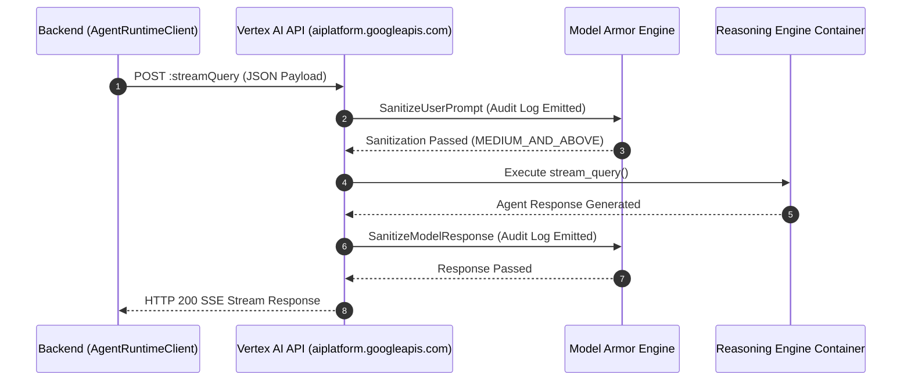
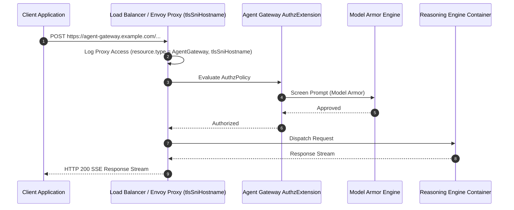

# GCP Agent Gateway & Multi-Agent Network Communication Specification

This document details the network communication architecture, protocol routing, and observability log schemas for the **GCP Multi-Agent Marketing Platform**. It explicitly compares **In-Line Policy Binding (`CLIENT_TO_AGENT`)** against **Proxy Host Deployments (`selfManaged` / Load Balancer Envoy Proxy)**.

### GCP Agent Gateway Enterprise Feature Architecture (Executive View)


### GCP Agent Gateway Feature Architecture (Clean Diagram View)


### Application Implementation Blueprint


---

## 🏛️ 1. Architecture & Network Overview

```
                                    +-----------------------+
                                    |     React Frontend    |
                                    | (Light/Dark Mode, Vite)|
                                    +-----------+-----------+
                                                |
                                                v (REST HTTP/JSON)
                                    +-----------------------+
                                    |    FastAPI Backend    |
                                    |   (Cloud Run / Local) |
                                    +-----------+-----------+
                                                |
                      +-------------------------+-------------------------+
                      |                                                   |
                      v (In-Line Policy Mode)                             v (Proxy Host Mode)
        +---------------------------+                       +---------------------------+
        | Agent Platform Control Plane   |                       | Custom Application Proxy  |
        | aiplatform.googleapis.com |                       | agent-gateway.example.com |
        +-------------+-------------+                       +-------------+-------------+
                      |                                                   |
                      v                                                   v
        +---------------------------+                       +---------------------------+
        | In-Line Model Armor       |                       | Proxy SNI Access Logger   |
        | (Audit Logs: modelarmor)  |                       | (tlsSniHostname Logging)  |
        +-------------+-------------+                       +-------------+-------------+
                      |                                                   |
                      +-------------------------+-------------------------+
                                                |
                                                v
                                    +-----------------------+
                                    | ADK Agent Runtime     |
                                    | (Reasoning Engine)    |
                                    +-----------------------+
```

---

## ⚖️ 2. Architectural Comparison

| Dimension | In-Line Policy Binding (`CLIENT_TO_AGENT`) | Proxy Host Deployment (`selfManaged` / ALB Envoy) |
| :--- | :--- | :--- |
| **Ingress Hostname** | Direct GCP API: `us-central1-aiplatform.googleapis.com` | Custom Proxy Host: `agent-gateway.example.com` or ALB IP |
| **Routing Path** | Client → Vertex AI API → In-Line Gateway Policy → Agent Container | Client → Load Balancer / Envoy → Gateway Authz → Agent Container |
| **Security Enforcement** | In-Line server-side Model Armor screening on `:streamQuery` | Proxy TLS SNI termination + Ingress Authz Policy checks |
| **Infrastructure Overhead** | **Zero Infra** (Fully managed by Google Cloud) | Requires Application Load Balancer, SSL Certs & VPC Attachments |
| **Log Format** | Cloud Audit Logs (`cloudaudit.googleapis.com`) & Model Armor audit events | Proxy Access Logs (`networkservices.googleapis.com/AgentGateway`) with `json_payload.tlsSniHostname` |
| **GCP Console Dashboard** | Shows `0` count (because Dashboard SQL filters for SNI proxy logs) | **Populates Metric Graphs** (matches `json_payload.tlsSniHostname` filter) |
| **Best Used For** | Fast, serverless multi-agent deployments with managed GCP API security | Enterprise VPC perimeters, custom DNS domains, and strict proxy access logging |

---

## 🔄 3. Communication Sequences

### 3.1 In-Line Policy Mode (`googleManaged.governedAccessPath: CLIENT_TO_AGENT`)

1. **Client Request**: The FastAPI backend sends an authenticated request to `https://us-central1-aiplatform.googleapis.com/v1beta1/{RE_ID}:streamQuery`.
2. **In-Line Policy Evaluation**: Vertex AI detects `spec.deploymentSpec.agentGatewayConfig` on the Reasoning Engine resource.
3. **Model Armor Callout**: Model Armor executes prompt sanitization before passing traffic to the container. Audit log entries (`SanitizeUserPrompt`) are emitted under `modelarmor.googleapis.com`.
4. **Agent Execution**: The ADK Agent processes the prompt and invokes sub-agents via the Agent-to-Agent (A2A) protocol.
5. **Response Sanitization**: Model Armor screens the output response (`SanitizeModelResponse`) and returns the SSE stream.



---

### 3.2 Proxy Host Mode (`selfManaged` / Load Balancer)

1. **Client Request**: Client sends traffic to `https://agent-gateway.example.com/v1beta1/{RE_ID}:streamQuery`.
2. **TLS SNI Termination**: The Application Load Balancer / Envoy proxy terminates TLS and populates `json_payload.tlsSniHostname`.
3. **Proxy Access Logging**: An access log with `resource.type = "networkservices.googleapis.com/AgentGateway"` and `json_payload.tlsSniHostname = "agent-gateway.example.com"` is emitted to Cloud Logging.
4. **Gateway Authz & Model Armor**: The proxy invokes the `AuthzExtension` and Model Armor to validate access.
5. **Backend Dispatch**: Traffic is dispatched to the backend Reasoning Engine instance.



---

## 📊 4. Telemetry & Log Schema Reference

### 4.1 In-Line Mode Log Queries (GCP Logs Explorer)

In **In-Line Policy Mode**, traffic and security decisions are queried via **Cloud Audit Logs**:

```logql
# View Model Armor Prompt & Response Security Inspections
logName:"cloudaudit.googleapis.com" AND protoPayload.serviceName="modelarmor.googleapis.com"

# View Agent Gateway Network Security Authz Policy Evaluations
logName:"cloudaudit.googleapis.com" AND protoPayload.serviceName="networksecurity.googleapis.com"

# Combined Security Governance Stream
logName:"cloudaudit.googleapis.com" AND (protoPayload.serviceName="networkservices.googleapis.com" OR protoPayload.serviceName="networksecurity.googleapis.com" OR protoPayload.serviceName="modelarmor.googleapis.com")
```

### 4.2 Proxy Host Mode Log Schema (Dashboard Query Compatibility)

The GCP Console Agent Gateway Dashboard executes the following SQL query against `_AllLogs`. For data to appear in this dashboard, logs must match the `gw_logs` CTE:

```sql
WITH gw_logs AS (
  SELECT
    JSON_VALUE(json_payload.tlsSniHostname) AS host,
    REGEXP_EXTRACT(JSON_VALUE(resource.labels.gateway_name), r'([^/]+)$') AS gateway_name,
    JSON_VALUE(resource.labels.location) AS location,
    REGEXP_EXTRACT(JSON_VALUE(json_payload.agentGatewayInfo.agentRegistryResource), r'((?:endpoints|mcpServers|agents)/[^/]+)') AS short_resource,
    JSON_VALUE(json_payload.authzPolicyInfo.result) = 'ALLOWED' AS gw_is_authorized,
    COUNT(*) AS gw_log_count
  FROM
    `agent-demo-09.global._Default._AllLogs`
  WHERE
    resource.type IN ("networkservices.googleapis.com/Gateway", "networkservices.googleapis.com/AgentGateway")
    AND JSON_VALUE(json_payload.tlsSniHostname) IS NOT NULL
    AND http_request.request_method != 'CONNECT'
    AND timestamp >= TIMESTAMP(@__range_start) AND timestamp <= TIMESTAMP(@__range_end)
  GROUP BY 1, 2, 3, 4, 5
)
SELECT
  IFNULL(SUM(gw_log_count), 0) as total_requests,
  CURRENT_TIMESTAMP() as current_time
FROM gw_logs
WHERE
  gateway_name = 'marketing-agent-gateway'
  AND location = 'us-central1'
```

---

## 🛠️ 5. Implementation Guide: Transitioning to Proxy Host Mode

To transition an application from In-Line Policy Mode to Proxy Host Mode:

1. **Provision Application Load Balancer & SSL Cert**:
   ```bash
   gcloud compute addresses create agent-gateway-ip --global --project=agent-demo-09
   gcloud compute ssl-certificates create agent-gateway-cert \
     --domains="agent-gateway.example.com" \
     --project=agent-demo-09
   ```

2. **Update `deploy/agent_gateway.yaml`**:
   ```yaml
   name: projects/agent-demo-09/locations/us-central1/agentGateways/marketing-agent-gateway
   description: Enterprise Agent Gateway with Proxy Host SNI Logging
   protocols:
     - MCP
   registries:
     - //agentregistry.googleapis.com/projects/agent-demo-09/locations/us-central1
   selfManaged:
     targetHttpsProxy: //compute.googleapis.com/projects/agent-demo-09/global/targetHttpsProxies/agent-gateway-target-proxy
   ```

3. **Re-Import Gateway Resource**:
   ```bash
   gcloud alpha network-services agent-gateways import marketing-agent-gateway \
     --source=deploy/agent_gateway.yaml \
     --location=us-central1 \
     --project=agent-demo-09
   ```

4. **Update Backend Ingress Host**:
   Configure `AGENT_GATEWAY_URL` in `.env` to target `https://agent-gateway.example.com`.
